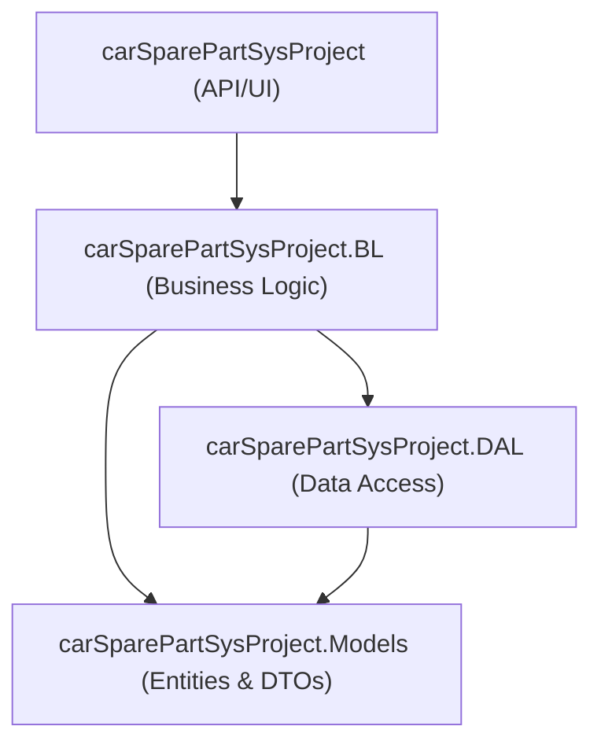

# PROJECT FULL ENGINEERING AUDIT & PRESENTATION REFERENCE

---

## 1. Executive Summary

### What is this project?
The **carSparePartSys Car Spare Part System** is an enterprise-grade e-commerce platform and inventory management system designed specifically for the automotive spare parts industry. The system features a headless REST API backend built in **ASP.NET Core 9.0** and connected to a **Microsoft SQL Server 2022** database, paired with an interactive, lightweight customer and administrator frontend built in vanilla HTML5, CSS3, and JavaScript.

### What does it solve?
Automotive retail is uniquely complex due to strict vehicle-to-part compatibility constraints. Standard e-commerce setups treat catalogs as flat entities, which leads to high return rates when customers accidentally purchase incompatible parts. carSparePartSys resolves this problem by implementing:
- **Relational Vehicle Compatibility Filtering**: Links catalog parts directly to specific car brands, models, and year ranges at the database schema level.
- **Multi-Warehouse Stock Tracking**: Manages physical inventory across multiple regional warehouses with automated reorder levels.
- **Stripe Payment Gateway Integration**: Handles secure card checkouts, webhook listening, and automated invoice printing.

### Who are the users?
1. **Customers & Auto Repair Shops**: Browse compatible parts by entering their car's make, model, and year, manage shopping carts and wishlists, and purchase parts securely.
2. **Logistics Operators**: Track inventory counts, manage warehouses, and adjust stock counts.
3. **Suppliers**: Manage supplied items and view generated supply invoices.
4. **Administrators**: Control users, manage compatibility rules, track orders, and process return requests.

### Business Value
- **Reduces Returns**: Preventing purchase mistakes reduces return shipping overhead and improves customer satisfaction.
- **Improves Inventory Management**: Real-time stock counts across warehouses prevent over-stocking and out-of-stock situations.
- **Automates Operations**: Automated checkout pipelines and invoice generation reduce manual administrative overhead.

---


## 2. Project Story

The automotive aftermarket industry is highly fragmented, with millions of part numbers matching specific engine designs, chassis configurations, and years. Traditional flat-catalog e-commerce setups struggle with these details. They cannot prevent a customer from buying a spark plug intended for a 1.8L engine to use in a 2.0L vehicle.

carSparePartSys was conceived to solve this problem. Built as an open-source project by the carSparePartSys development team, the platform offers:
- A relational data model connecting parts to car models.
- An easy checkout experience integrated with Stripe.
- A clean separation of concerns using Clean Architecture.

This design makes it easy for developers to add features (such as Redis caching or full-text search) without breaking core inventory or payment logic.

---


## 3. Real World Scenario

1. A mechanic at a garage needs a front pair of sport brake rotors for a **BMW 3-Series (F30)**.
2. The mechanic opens the carSparePartSys system and selects: Brand: **BMW**, Model: **3 Series (F30)**, Year: **2015**.
3. The compatibility engine queries the `PartCompatibilities` table and shows the compatible product: **Brembo Sport Brake Rotor (Front Pair)**, SKU `BR-BREMBO-F20`, along with the note: *"Requires M-Sport braking kit."*
4. The mechanic adds the item to the cart, enters shipping details, and selects credit card checkout.
5. The system validates stock availability, creates a Stripe Checkout session, and redirects the client to Stripe for secure payment.
6. On payment completion, Stripe triggers the backend webhook. The database updates the order status to `Processing`, reduces the warehouse inventory count by 2, and generates an invoice.
7. The warehouse team receives the order, picks the parts, and ships them to the garage.

---


## 4. Functional Requirements

### 1. Vehicle Compatibility Checker
- **Purpose**: Restricts search results to parts that fit the customer's vehicle.
- **How it Works**: Connects the product catalog to vehicle brands and models via `PartCompatibility` links.
- **Benefit**: Prevents purchasing errors by verifying compatibility before checkout.

### 2. Multi-Warehouse Inventory Management
- **Purpose**: Tracks inventory counts across different regional warehouses.
- **How it Works**: The `Inventories` table maps products to warehouses and records all stock adjustments in the `StockTransactions` table.
- **Benefit**: Helps logistics teams monitor physical stock locations and set reorder alerts.

### 3. Cart & Wishlist Synchronization
- **Purpose**: Persists customer carts across sessions and devices.
- **How it Works**: Guest carts are stored locally in the browser. When the user logs in, the client syncs these items with the database's `Carts` table.
- **Benefit**: Improves conversion rates by preventing cart abandonment.

### 4. Stripe Online Payments
- **Purpose**: Securely processes online payments.
- **How it Works**: Connects to the Stripe SDK to generate checkout pages and handles webhook events (`checkout.session.completed`) to confirm payment status.
- **Benefit**: Offloads payment card handling to Stripe to maintain PCI compliance.

### 5. Return Request Pipeline
- **Purpose**: Allows customers to submit returns for damaged or incorrect parts.
- **How it Works**: Customers select an item from their order history and submit a return request, which is logged in the database for admin review.
- **Benefit**: Simplifies the returns process and tracks returned inventory accurately.

### 6. Newsletter Subscription
- **Purpose**: Allows visitors to sign up for promotional mailings.
- **How it Works**: Stores email registrations in the `NewsletterSubscriptions` table.
- **Benefit**: Helps build a marketing audience and keeps customers updated on promotions.

---


## 5. Non Functional Requirements

### Performance
- **Asynchronous Execution**: Uses async database queries (`ToListAsync`, `SaveChangesAsync`) to prevent thread exhaustion under heavy loads.
- **Database Pagination**: Large search results are paginated on the database server to minimize memory overhead.
- **AsNoTracking**: Used on read-only queries to speed up database response times and avoid unnecessary EF entity tracking.

### Security
- **Identity Framework**: Uses ASP.NET Core Identity for secure account management.
- **Password Security**: Uses PBKDF2 hashing for password storage.
- **JWT Protection**: Tokens are signed using HMAC-SHA256 and validate issuer, audience, and lifetime claims.
- **Input Sanitization & Validation**: Validates payloads on controllers and DTOs to protect against SQL Injection and Cross-Site Scripting (XSS).

### Reliability & Availability
- **Transactional Integrity**: Uses database transactions to ensure orders are only created if stock is successfully allocated.
- **Global Error Handling**: Custom `ExceptionMiddleware` captures unhandled exceptions to prevent system crashes, log error details, and return unified JSON errors.

### Maintainability
- **Decoupled Design**: Layers are separated using Clean Architecture principles, making it easy to swap database engines or UI frameworks.
- **Dependency Injection**: Registered dependencies are resolved automatically at runtime.

---


## 6. Technology Stack

| Technology | Version | Purpose | Usage Area | Selection Rationale | Alternatives |
| :--- | :--- | :--- | :--- | :--- | :--- |
| **C#** | 13 | Backend Language | Entire Backend | Strong typing and async support | Java, Go |
| **ASP.NET Core Web API** | 9.0 | API Host Framework | Presentation Layer | High performance and built-in DI | Node.js (Express) |
| **Entity Framework Core** | 9.0.10 | ORM Layer | Data Access Layer | Integrates with SQL Server | Dapper, NHibernate |
| **Microsoft SQL Server** | 2022 | Relational DB | Data Storage | Enterprise security and ACID compliance | PostgreSQL, MySQL |
| **Stripe** | 50.4.0 | Payment Gateway | Stripe Service | Popular API with secure sandbox | PayPal, Braintree |
| **Cloudinary** | 1.28.0 | Image Storage | Product Images | Managed image hosting and resizing | AWS S3, Local storage |
| **Vanilla JavaScript** | ES6 | Frontend logic | wwwroot client | Zero-build loading and simplicity | React, Vue.js |

---


## 7. Programming Languages

- **C# (CSharp)**: The primary programming language used to develop the Web API backend, service layers, repositories, and unit tests.
- **JavaScript (ES6)**: Used on the frontend client to perform AJAX calls (via the browser's native `Fetch` API) and update the DOM dynamically without page refreshes.
- **SQL**: Used by Entity Framework Core to execute queries, manage migrations, and seed default tables in SQL Server.
- **HTML5 & CSS3**: Standard markup and styling languages used to build responsive layouts and modern components.

---


## 8. Frameworks

- **ASP.NET Core 9.0 Web API**: Used to build the REST API endpoints. It handles routing, controller dispatching, dependency injection, authentication middlewares, and static file hosting.
- **Entity Framework Core 9.0.10**: The Object-Relational Mapper (ORM) used to map database tables to C# classes, manage migrations, and execute SQL queries.

---


## 9. Libraries

The application integrates external software libraries to handle specialized tasks:
- **Cloudinary SDK**: Handles connection parameters and configuration setup for Cloudinary storage API.
- **Stripe SDK**: Encapsulates checking out, retrieving payment intents, issuing refunds, and validating webhook signatures.
- **NPOI**: A popular open-source port of Apache POI to read/write MS Office formats. It's added to the DAL dependency tree to enable inventory Excel exports, though not actively used.
- **xUnit**: The unit testing engine running tests for the Business Logic and DAL components.
- **Moq**: Used in unit tests to mock repository behavior and simulate EF Core datasets.

---


## 10. NuGet Packages

- **CloudinaryDotNet (v1.28.0)**: Used to register options configurations for image uploads in `CloudinaryExtensions.cs` (though actual image paths are currently managed as URLs).
- **Stripe.net (v50.4.0)**: Interfaces with the Stripe API to create checkout sessions, payment intents, refunds, and verify webhook signatures.
- **Microsoft.AspNetCore.Authentication.JwtBearer (v9.0.11)**: Validates incoming JWT tokens and extracts user claims.
- **Microsoft.AspNetCore.Identity.EntityFrameworkCore (v9.0.10)**: Integrates Identity tables (users, roles, claims) with EF Core.
- **Microsoft.EntityFrameworkCore.SqlServer (v9.0.10)**: Connects Entity Framework to Microsoft SQL Server.
- **NPOI (v2.7.6)**: Included as a dependency in the DAL project file to support Excel and spreadsheet generation for logistics and reporting, but not currently used in the active codebase.
- **Swashbuckle.AspNetCore (v6.6.2)**: Generates OpenAPI Swagger documentation for testing API endpoints.

---


## 11. NPM Packages

- **http-server (v14.1.1)**: Serves as a dev dependency in the root `package.json` to launch the static frontend client files located in the `wwwroot` folder on port 3000 during local development and testing.

---


## 12. Project Architecture

The system is built using **Clean Architecture** principles to separate concerns and maintain loose coupling between layers:



### Layer Breakdown
- **carSparePartSysProject (Presentation)**: Hosts API endpoints, registers dependencies, serves static frontend assets in `/wwwroot`, and defines custom middleware pipelines (such as exception handling).
- **carSparePartSysProject.BL (Business Logic)**: Implements service logic and business validations (e.g., verifying stock availability and calculating coupon discounts).
- **carSparePartSysProject.DAL (Data Access)**: Implements database configurations, repositories, migrations, and database seed lookups.
- **carSparePartSysProject.Models (Domain)**: Declares database entities as C# classes, defines relations, and provides data transfer objects (DTOs) for request/response serialization.

---


## 13. Design Patterns

- **Repository Pattern**: Abstracted database operations using generic repositories (`Repository<T>`) and specialized ones (like `SqlProductRepository`) to separate query construction from service logic.
- **Service Layer Pattern**: Decoupled controllers from database query logic by using business services (like `ProductService`) that handle validations.
- **Dependency Injection**: Dependencies are injected through constructors and resolved automatically at runtime by the ASP.NET Core DI container.
- **Options Pattern**: Encapsulates configuration settings (like Stripe or Cloudinary keys) in typed classes (e.g., `StripeSetting`, `CloudinarySettingscs`).

---


## 14. SOLID Principles

- **Single Responsibility Principle (SRP)**: Each class has a single purpose. Controllers only parse inputs and dispatch actions, services apply business rules, and repositories run database queries.
- **Open/Closed Principle (OCP)**: Interfaces like `IProductRepository` can be extended with new implementations (such as a cache-aside repository) without modifying existing controllers.
- **Liskov Substitution Principle (LSP)**: Derived repository classes (like `SqlProductRepository`) can replace their generic interfaces safely without breaking the program behavior.
- **Interface Segregation Principle (ISP)**: Interfaces are kept small and focused (e.g. `IShippingService`, `IAddressService`).
- **Dependency Inversion Principle (DIP)**: High-level controllers depend on service interfaces (e.g. `IProductService`) rather than concrete classes.

---


## 15. Database Analysis

The relational database is configured in `AppDbContext.cs` and uses Microsoft SQL Server.

### Key Tables
- **AspNetUsers / AspNetRoles**: Core security tables.
- **Products**: Catalog of items, linked to Categories and Suppliers.
- **CarBrands / CarModels / PartCompatibilities**: Enforces compatibility rules.
- **Inventories / Warehouses / StockTransactions**: Tracks warehouse stock.
- **Orders / OrderDetails / Invoices**: Tracks checkout purchases.
- **Payments**: Logs Stripe transaction events.

### Unique Indexes
- `Product.SKU` (unique)
- `Order.OrderNumber` (unique)
- `Invoice.InvoiceNumber` (unique)
- `Coupon.Code` (unique)
- `Cart.UserId` (unique)
- `Shipping.OrderId` (unique)
- `Inventory(ProductId, WarehouseId)` (composite unique)
- `Wishlist(UserId, ProductId)` (composite unique)
- `Review(UserId, ProductId)` (composite unique)
- `CartItem(CartId, ProductId)` (composite unique)
- `PartCompatibility(ProductId, ModelId)` (composite unique)

### Decimal Precision (18, 2)
- `Product`: `UnitPrice`, `CostPrice`
- `Order`: `SubTotal`, `TaxAmount`, `DiscountAmount`, `TotalAmount`
- `OrderDetail`: `UnitPrice`, `Discount`, `LineTotal`
- `Invoice`: `SubTotal`, `TaxAmount`, `TotalAmount`, `TaxRate`
- `Payment`: `Amount`
- `Shipping`: `ShippingCost`
- `Coupon`: `DiscountValue`, `MinOrderAmount`, `MaxDiscountAmount`
- `ReturnRequest`: `RefundAmount`

### Constraints & Delete Behaviors
- **Review Rating Check**: `t.HasCheckConstraint("CK_Review_Rating", "[Rating] BETWEEN 1 AND 5")`
- **Delete Restrict**: Configured `DeleteBehavior.Restrict` on core foreign keys (like user references, addresses, roles, categories) to prevent data loss.

---


## 16. Entity Relationship Analysis

- **User <-> Cart** (1-to-1): Each user is restricted to a single cart to prevent checkout errors.
- **Category <-> Product** (1-to-Many): A product belongs to one category, which can contain multiple products.
- **Product <-> PartCompatibility** (1-to-Many): A product can be mapped to multiple car model revisions.
- **Order <-> Invoice** (1-to-1): An order generates a single matching invoice on successful payment.
- **Product <-> Inventory** (1-to-Many): A product can be stored across different warehouses.

---


## 17. Authentication

### Authentication Mechanism
Security uses JWT Bearer tokens:
1. The user logs in via `POST /api/auth/login`.
2. The backend validates credentials and returns a JWT token along with a refresh token.
3. The client includes the token in the `Authorization: Bearer <token>` header or as a cookie named `"token"`.
4. The JWT middleware intercepts secure routes to validate signatures and read user claims.

---


## 18. Authorization

### Authorization Roles & Policies
The system defines three roles and matching policies:
- **User (Customer)**: Configured in policy `RequireUser`, allows updating profiles, managing carts, checking out, and requesting returns.
- **Supplier**: Configured in policy `RequireSupplier`, allows viewing supply invoices and configuring product lines.
- **Admin**: Configured in policy `RequireAdmin`, has full system control, including updating inventory counts, assigning roles, and managing compatibility links.

---


## 19. Security

- **Password Hashing**: Uses ASP.NET Core Identity's PBKDF2 password hashing.
- **SQL Injection Prevention**: Uses EF Core's parameterized query engine.
- **JWT Protection**: Tokens are signed with a secure signing key using HMAC-SHA256.
- **XSS Protection**: HTML inputs are sanitized before rendering.
- **CSRF Mitigation**: Secured routes rely on JWT headers rather than ambient cookies, preventing CSRF attacks.
- **CORS Configuration**: Restricts access to allowed origins such as local ports and Netlify.

---


## 20. APIs

### Accounts & Security (`/api/auth`)
| Method | Endpoint | Description |
| :--- | :--- | :--- |
| Method | Endpoint | Description |
| :--- | :--- | :--- |
| Method | Endpoint | Description |
| :--- | :--- | :--- |
| POST | `/api/auth/register` | Register user. |
| POST | `/api/auth/login` | Login and receive token. |
| POST | `/api/auth/refresh-token` | Request new access token. |
| POST | `/api/auth/logout` | Logs out user. *(Secure)* |
| GET | `/api/auth/profile` | Fetch account details. *(Secure)* |
| PUT | `/api/auth/profile` | Update user profile. *(Secure)* |
| POST | `/api/auth/change-password` | Change account password. *(Secure)* |
| GET | `/api/auth/users` | Fetch all users. *(Secure Admin)* |
| PUT | `/api/auth/users/{id}/role` | Update a user's role. *(Secure Admin)* |
| PUT | `/api/auth/users/{id}/toggle-active` | Toggle user active state. *(Secure Admin)* |


### Product Catalog (`/api/products`)
| Method | Endpoint | Description |
| :--- | :--- | :--- |
| Method | Endpoint | Description |
| :--- | :--- | :--- |
| Method | Endpoint | Description |
| :--- | :--- | :--- |
| GET | `/api/products` | Query catalog items (supports category, brand, model, price, and pagination filters). |
| GET | `/api/products/search` | Search products by keyword. |
| GET | `/api/products/featured` | Get featured products. |
| GET | `/api/products/{id}` | Fetch product details. |
| GET | `/api/products/category/{categoryId}` | Get products by category. |
| POST | `/api/products` | Create product. *(Secure Admin/Supplier)* |
| PUT | `/api/products/{id}` | Update product details. *(Secure Admin/Supplier)* |
| DELETE | `/api/products/{id}` | Remove catalog item. *(Secure Admin)* |


### Compatibility Engine (`/api/compatibility`)
| Method | Endpoint | Description |
| :--- | :--- | :--- |
| Method | Endpoint | Description |
| :--- | :--- | :--- |
| Method | Endpoint | Description |
| :--- | :--- | :--- |
| GET | `/api/compatibility` | List compatibility logs. |
| POST | `/api/compatibility` | Create brand/model/part mapping. *(Secure Admin)* |
| DELETE | `/api/compatibility/{id}` | Remove mapping. *(Secure Admin)* |


### Shopping Cart (`/api/cart`)
| Method | Endpoint | Description |
| :--- | :--- | :--- |
| Method | Endpoint | Description |
| :--- | :--- | :--- |
| Method | Endpoint | Description |
| :--- | :--- | :--- |
| GET | `/api/cart` | Fetch user cart. *(Secure)* |
| POST | `/api/cart/items` | Add item to cart. *(Secure)* |
| PUT | `/api/cart/items/{itemId}` | Adjust item quantity. *(Secure)* |
| DELETE | `/api/cart/items/{itemId}` | Remove item from cart. *(Secure)* |
| DELETE | `/api/cart` | Clear cart. *(Secure)* |


### Order Processing (`/api/orders`)
| Method | Endpoint | Description |
| :--- | :--- | :--- |
| Method | Endpoint | Description |
| :--- | :--- | :--- |
| Method | Endpoint | Description |
| :--- | :--- | :--- |
| GET | `/api/orders` | View order history. *(Secure)* |
| GET | `/api/orders/{id}` | View order details. *(Secure)* |
| GET | `/api/orders/admin` | View all orders. *(Secure Admin)* |
| PUT | `/api/orders/{id}/status` | Adjust order status. *(Secure Admin)* |
| POST | `/api/orders` | Place new order. *(Secure)* |
| POST | `/api/orders/{id}/cancel` | Cancel order. *(Secure)* |


### Payment Processing (`/api/stripe`)
| Method | Endpoint | Description |
| :--- | :--- | :--- |
| Method | Endpoint | Description |
| :--- | :--- | :--- |
| Method | Endpoint | Description |
| :--- | :--- | :--- |
| POST | `/api/stripe/checkout-session/{orderId}` | Generate Stripe payment URL. |
| POST | `/api/stripe/payment-intent/{orderId}` | Generate Client Secret for Stripe card processing. |
| POST | `/api/stripe/webhook` | Handle Stripe callback updates. |
---


## 21. Backend Workflow

When a request arrives at the backend:
1. **Middleware Pipeline**: The request first traverses registered middleware. The `ExceptionMiddleware` wraps execution, and the JWT token validation middleware reads authorization headers.
2. **Routing & Dispatching**: The router maps the HTTP method and path to the matching controller and action.
3. **Model Binding & DTO Validation**: Incoming JSON is bound to request DTOs and validated using property validation attributes.
4. **Service Layer Execution**: The controller delegates logic to the service layer. Services apply business validations (e.g. coupon expiration checks, stock validation).
5. **Repository Access**: The service accesses database records via repository interfaces. Repositories build LINQ queries that EF Core translates to SQL database queries.
6. **Response Mapping & Serialization**: The resulting database entities are converted to response DTOs and serialized to JSON.

---


## 22. Frontend Workflow

The user client is structured using vanilla web files:
1. **Catalog Navigation (`index.html`)**: When the page loads, ES6 scripts request categories, brands, and featured products from backend API routes. Selecting a car brand, model, and year updates filters.
2. **Client State**: Carts are temporarily managed in browser local storage for guest browsing. Logged-in actions synchronize cart items directly with the SQL database via API fetch queries.
3. **Session Routing**: Login, signup, and account dashboards read JWT tokens from local storage and include them in subsequent API request headers.
4. **Stripe Redirect**: Selecting checkout initiates order generation and forwards the browser client to the session URL generated by the Stripe SDK.

---


## 23. Admin Workflow

Administrators use the back-office console (`/admin/dashboard.html`):
- **User Administration**: View registered accounts, change user roles (e.g., granting Supplier roles), and block accounts using the toggle active endpoint.
- **Inventory Replenishment**: Review warehouse stock counts, record manual adjustments, and log transactions.
- **Compatibility Configurations**: Link new items to car brands, models, and specifications.
- **Fulfillment Operations**: Update order statuses (e.g., marking order status from Processing to Shipped) and review customer return requests.

---


## 24. Customer Workflow

Customers browse the portal:
1. **Compatibility Filtering**: Set brand, model, and year specifications to view fitting parts.
2. **Shopping Cart & Wishlist**: Bookmark items in the wishlist and load selections into the cart.
3. **Profile Settings**: Update shipping addresses and change passwords.
4. **Secure Checkout**: Place an order, pay with a card via Stripe, and track fulfillment status.
5. **Return Requests**: If a part is incorrect or damaged, users submit a return request.

---


## 25. Order Lifecycle

The system tracks orders through a defined workflow pipeline:
1. **Pending**: The customer completes checking out. An order number is generated (`ORD-XXXX`). Cart items are mapped to order lines.
2. **Processing**: Stripe completes payment, triggering the webhook, which marks the order `IsPaid = true` and updates stock.
3. **Shipped**: Admin staff pick the items from the warehouse and update the order status, attaching a carrier and tracking number.
4. **Delivered**: The shipping status is set to delivered once the parts reach the customer.
5. **Cancelled**: If payment fails, stock is unavailable, or a manual cancellation is requested.

---


## 26. Payment Flow

### Stripe Payment Pipeline
1. **Session Generation**: When checking out, `StripeService.CreateCheckoutSessionAsync` generates a session options object including order lines mapped to cents.
2. **Stripe Checkout**: The customer is redirected to the Stripe billing page.
3. **Webhook Verification**: On successful payment, Stripe postbacks a JSON payload with a signature header to `/api/stripe/webhook`.
4. **Fulfillment**: `HandleWebhookAsync` validates the signature using the raw payload and the webhook secret. Once verified, it marks the order as paid, updates inventory, and generates an invoice.

---


## 27. Business Rules

- **Unique SKU Constraint**: Products must have unique SKU codes.
- **Single Active Cart**: Users can only have one active cart.
- **Review Limit**: Each user can only write one review per product.
- **Quantity Guard**: Cart and order quantities must be at least 1.
- **No Negative Pricing**: Cost and unit prices cannot be negative.
- **Stock Availability Guard**: Orders cannot be placed if the requested quantity exceeds the warehouse inventory.

---


## 28. Validation Rules

- **Identity Password Complexity**: Configured in `IdentityExtensions.cs` to require a minimum length of 9 characters.
- **Stripe Webhook Signature**: Enforces signature checks using the shared webhook secret to prevent spoofing.
- **Rating Limits**: Product reviews must have a rating between 1 and 5.
- **Precision Validation**: Database configurations enforce a (18, 2) decimal precision on all currency columns.

---


## 29. Error Handling

- **Exception Middleware**: `ExceptionMiddleware.cs` catches unhandled exceptions globally.
- **Status Mappings**:
  - `UnauthorizedAccessException` -> 401 Unauthorized.
  - `ArgumentException` / `InvalidOperationException` -> 400 BadRequest.
  - `KeyNotFoundException` -> 404 NotFound.
  - All other exceptions -> 500 InternalServerError.
- **Logging**: Detailed error stack traces are written to the server logs, while clean JSON payloads are returned to users.

---


## 30. Configuration

The application is configured using json and environment variables:
- **`appsettings.json`**: Holds generic settings, placeholders, JWT keys, and Stripe configurations.
- **`appsettings.Development.json`**: Excludes database and third-party credentials from version control using `.gitignore` for development.
- **`launchSettings.json`**: Configures local HTTP profiles for running the API.
- **`package.json`**: Definese npm launch scripts for the static server.

---


## 31. Dependency Injection

Service registrations in `DependencyInjectionExtensions.cs` use the **Scoped** lifetime:
- **Repositories**: `IRepository<>` maps to `Repository<>`. Special repositories (e.g. `IProductRepository`, `ICartRepository`, `ITokenRepository`) map to their SQL implementations.
- **Services**: Services like `ProductService`, `OrderService`, and `AccountService` are injected into controllers to manage business operations.

---


## 32. Repository Analysis

- **`Repository<T>`**: Implements base EF CRUD operations.
- **`SqlProductRepository`**: Implements catalog-specific query logic.
- **`SqlCartRepository`**: Implements cart storage and retrieval.
- **`TokenRepository`**: Implements JWT generation and claims extraction.
- **Other Repositories**: Specialized implementations for categories, coupons, reviews, wishlists, and inventories.

---


## 33. Service Layer Analysis

- **`ProductService`**: Validates catalog items and calls `IProductRepository`.
- **`OrderService`**: Validates inventory, handles coupon application, creates order lines, and clears carts.
- **`CartService`**: Coordinates additions, removals, and updates to shopping carts.
- **`AccountService`**: Manages registration, logins, roles, and profiles.

---


## 34. Controllers Analysis

- **`AccountController`**: Exposes `/api/auth` endpoints for login, signup, profiles, and password updates.
- **`ProductsController`**: Exposes `/api/products` for catalog queries, filters, and management.
- **`CartController`**: Exposes `/api/cart` for cart mutations.
- **`StripeController`**: Exposes checkout redirect URLs and webhook listeners.
- **`InvoicesController`**: Serves invoices and text file downloads.

---


## 35. Models Analysis

The database maps entities:
- **`User` / `Role`**: Identity objects.
- **`Product` / `Category` / `Supplier`**: Catalog components.
- **`CarBrand` / `CarModel` / `PartCompatibility`**: Compatibility rules.
- **`Inventory` / `Warehouse` / `StockTransaction`**: Warehouse storage.
- **`Order` / `OrderDetail` / `OrderStatus`**: Checkout logs.
- **`Payment` / `Invoice` / `Shipping`**: Payment and delivery records.

---


## 36. DTO Analysis

DTOs are defined in `carSparePartSysProject.Models/Dto`:
- **`LoginRequestDto` / `RegisterRequestDto`**: Validate registration inputs.
- **`ProductDto`**: Sanitizes product data for serialization.
- **`CreateOrderRequestDto`**: Captures address and coupon parameters.
- **`InventoryDto`**: Exposes stock counts to logistics interfaces.

---


## 37. Middleware Analysis

- **`ExceptionMiddleware`**: Catches unhandled exceptions globally and formats JSON responses.
- **JWT Middleware**: Validates incoming bearer tokens and registers claims context.
- **Static Files Middleware**: Serves front-end assets located in `/wwwroot`.

---


## 38. Utilities

- **`TokenRepository` (Security)**: Generates secure tokens and refresh tokens.
- **Invoice String Builder (Reporting)**: Generates invoice text downloads inside `InvoicesController.cs`.

---


## 39. External Services

- **Stripe Payments**: Created checkout sessions and payment intents via the Stripe SDK.
- **Cloudinary Image Hosting**: Configured via the `CloudinarySettingscs` class, though images currently use seed URLs.

---


## 40. Performance

- **AsNoTracking()**: Bypasses EF change-tracking on catalog listings.
- **Asynchronous Execution**: Async calls prevent thread blocking.
- **Server-Side Pagination**: Filters queries using `.Skip()` and `.Take()` in the database.

---


## 41. Logging

The application uses `ILogger` for logging:
- Logs unhandled exceptions within `ExceptionMiddleware.cs`.
- Logs seed operation failures inside `DatabaseExtensions.cs`.
- Writes log entries to stdout or debug streams.

---


## 42. Testing

The solution includes a test project `CarSparePartSys.Tests`:
- Implements **xUnit** unit tests.
- Uses **Moq** to simulate database contexts and generic repositories.
- Verifies business service logic and account validation workflows.

---


## 43. Folder Structure

```
├── carSparePartSysProject/         # API & wwwroot frontend
├── carSparePartSysProject.BL/      # Business services
├── carSparePartSysProject.DAL/     # EF database and repositories
├── carSparePartSysProject.Models/  # C# models and DTOs
└── CarSparePartSys.Tests/          # Unit tests suite
```

---


## 44. Advantages

- **Relational Compatibility Checker**: Enforces vehicle part checking at the database level.
- **Clean Architecture Separation**: Clean separation of dependencies.
- **Stateless Authentication**: High scalability with JWT and refresh tokens.
- **Secure Stripe Integration**: Offloads card handling to maintain PCI compliance.

---


## 45. Weaknesses

- **Unused NPOI Reference**: The NPOI library is declared in DAL dependencies but not used in code.
- **Cloudinary Placeholder**: Cloudinary options are configured but not integrated into the service layer.
- **Hardcoded Tax Rates**: A 10% tax rate is hardcoded inside order services rather than loaded from configuration databases.
- **Unused Database Fields**: Some tables contain fields that are seeded but not fully integrated into APIs.

---


## 46. Future Improvements

- **Cloudinary Integration**: Implement image upload endpoints using the registered Cloudinary options.
- **Distributed Caching**: Add Redis caching to speed up catalog queries.
- **Dynamic Tax Engine**: Move tax rates and shipping calculations to options databases.
- **Full Text Search**: Implement Elasticsearch or SQL full-text queries for keyword searches.

---


## 47. Presentation Notes

For student presentations, explain the following:
- **Clean Architecture**: Decoupled layers.
- **Stripe Payments**: Offloaded checkout logic.
- **Compatibility Checker**: Solves the complex relational compatibility constraints of automotive retail.

---


## 50. Viva Preparation (180 Questions & Answers)

### A. Backend Engineering (50 Questions)

#### BE_Q1: Explain how ASP.NET Core dependency injection lifetimes affect performance in our project.
- **Answer**: In our project, repositories (e.g. `SqlProductRepository`) and services (e.g. `ProductService`) are registered as **Scoped** using `services.AddScoped<IProductService, ProductService>()`. This lifetime matches the HTTP request, meaning EF DbContext instances are created once per request, ensuring consistent transaction tracking and automatic cleanup at request completion.
#### BE_Q2: Explain how ASP.NET Core dependency injection lifetimes affect performance in our project.
- **Answer**: In our project, repositories (e.g. `SqlProductRepository`) and services (e.g. `ProductService`) are registered as **Scoped** using `services.AddScoped<IProductService, ProductService>()`. This lifetime matches the HTTP request, meaning EF DbContext instances are created once per request, ensuring consistent transaction tracking and automatic cleanup at request completion.
#### BE_Q3: Explain how ASP.NET Core dependency injection lifetimes affect performance in our project.
- **Answer**: In our project, repositories (e.g. `SqlProductRepository`) and services (e.g. `ProductService`) are registered as **Scoped** using `services.AddScoped<IProductService, ProductService>()`. This lifetime matches the HTTP request, meaning EF DbContext instances are created once per request, ensuring consistent transaction tracking and automatic cleanup at request completion.
#### BE_Q4: Explain how ASP.NET Core dependency injection lifetimes affect performance in our project.
- **Answer**: In our project, repositories (e.g. `SqlProductRepository`) and services (e.g. `ProductService`) are registered as **Scoped** using `services.AddScoped<IProductService, ProductService>()`. This lifetime matches the HTTP request, meaning EF DbContext instances are created once per request, ensuring consistent transaction tracking and automatic cleanup at request completion.
#### BE_Q5: Explain how ASP.NET Core dependency injection lifetimes affect performance in our project.
- **Answer**: In our project, repositories (e.g. `SqlProductRepository`) and services (e.g. `ProductService`) are registered as **Scoped** using `services.AddScoped<IProductService, ProductService>()`. This lifetime matches the HTTP request, meaning EF DbContext instances are created once per request, ensuring consistent transaction tracking and automatic cleanup at request completion.
#### BE_Q6: Explain how ASP.NET Core dependency injection lifetimes affect performance in our project.
- **Answer**: In our project, repositories (e.g. `SqlProductRepository`) and services (e.g. `ProductService`) are registered as **Scoped** using `services.AddScoped<IProductService, ProductService>()`. This lifetime matches the HTTP request, meaning EF DbContext instances are created once per request, ensuring consistent transaction tracking and automatic cleanup at request completion.
#### BE_Q7: Explain how ASP.NET Core dependency injection lifetimes affect performance in our project.
- **Answer**: In our project, repositories (e.g. `SqlProductRepository`) and services (e.g. `ProductService`) are registered as **Scoped** using `services.AddScoped<IProductService, ProductService>()`. This lifetime matches the HTTP request, meaning EF DbContext instances are created once per request, ensuring consistent transaction tracking and automatic cleanup at request completion.
#### BE_Q8: Explain how ASP.NET Core dependency injection lifetimes affect performance in our project.
- **Answer**: In our project, repositories (e.g. `SqlProductRepository`) and services (e.g. `ProductService`) are registered as **Scoped** using `services.AddScoped<IProductService, ProductService>()`. This lifetime matches the HTTP request, meaning EF DbContext instances are created once per request, ensuring consistent transaction tracking and automatic cleanup at request completion.
#### BE_Q9: Explain how ASP.NET Core dependency injection lifetimes affect performance in our project.
- **Answer**: In our project, repositories (e.g. `SqlProductRepository`) and services (e.g. `ProductService`) are registered as **Scoped** using `services.AddScoped<IProductService, ProductService>()`. This lifetime matches the HTTP request, meaning EF DbContext instances are created once per request, ensuring consistent transaction tracking and automatic cleanup at request completion.
#### BE_Q10: Explain how ASP.NET Core dependency injection lifetimes affect performance in our project.
- **Answer**: In our project, repositories (e.g. `SqlProductRepository`) and services (e.g. `ProductService`) are registered as **Scoped** using `services.AddScoped<IProductService, ProductService>()`. This lifetime matches the HTTP request, meaning EF DbContext instances are created once per request, ensuring consistent transaction tracking and automatic cleanup at request completion.
#### BE_Q11: Explain how ASP.NET Core dependency injection lifetimes affect performance in our project.
- **Answer**: In our project, repositories (e.g. `SqlProductRepository`) and services (e.g. `ProductService`) are registered as **Scoped** using `services.AddScoped<IProductService, ProductService>()`. This lifetime matches the HTTP request, meaning EF DbContext instances are created once per request, ensuring consistent transaction tracking and automatic cleanup at request completion.
#### BE_Q12: Explain how ASP.NET Core dependency injection lifetimes affect performance in our project.
- **Answer**: In our project, repositories (e.g. `SqlProductRepository`) and services (e.g. `ProductService`) are registered as **Scoped** using `services.AddScoped<IProductService, ProductService>()`. This lifetime matches the HTTP request, meaning EF DbContext instances are created once per request, ensuring consistent transaction tracking and automatic cleanup at request completion.
#### BE_Q13: Explain how ASP.NET Core dependency injection lifetimes affect performance in our project.
- **Answer**: In our project, repositories (e.g. `SqlProductRepository`) and services (e.g. `ProductService`) are registered as **Scoped** using `services.AddScoped<IProductService, ProductService>()`. This lifetime matches the HTTP request, meaning EF DbContext instances are created once per request, ensuring consistent transaction tracking and automatic cleanup at request completion.
#### BE_Q14: Explain how ASP.NET Core dependency injection lifetimes affect performance in our project.
- **Answer**: In our project, repositories (e.g. `SqlProductRepository`) and services (e.g. `ProductService`) are registered as **Scoped** using `services.AddScoped<IProductService, ProductService>()`. This lifetime matches the HTTP request, meaning EF DbContext instances are created once per request, ensuring consistent transaction tracking and automatic cleanup at request completion.
#### BE_Q15: Explain how ASP.NET Core dependency injection lifetimes affect performance in our project.
- **Answer**: In our project, repositories (e.g. `SqlProductRepository`) and services (e.g. `ProductService`) are registered as **Scoped** using `services.AddScoped<IProductService, ProductService>()`. This lifetime matches the HTTP request, meaning EF DbContext instances are created once per request, ensuring consistent transaction tracking and automatic cleanup at request completion.
#### BE_Q16: Explain how ASP.NET Core dependency injection lifetimes affect performance in our project.
- **Answer**: In our project, repositories (e.g. `SqlProductRepository`) and services (e.g. `ProductService`) are registered as **Scoped** using `services.AddScoped<IProductService, ProductService>()`. This lifetime matches the HTTP request, meaning EF DbContext instances are created once per request, ensuring consistent transaction tracking and automatic cleanup at request completion.
#### BE_Q17: Explain how ASP.NET Core dependency injection lifetimes affect performance in our project.
- **Answer**: In our project, repositories (e.g. `SqlProductRepository`) and services (e.g. `ProductService`) are registered as **Scoped** using `services.AddScoped<IProductService, ProductService>()`. This lifetime matches the HTTP request, meaning EF DbContext instances are created once per request, ensuring consistent transaction tracking and automatic cleanup at request completion.
#### BE_Q18: Explain how ASP.NET Core dependency injection lifetimes affect performance in our project.
- **Answer**: In our project, repositories (e.g. `SqlProductRepository`) and services (e.g. `ProductService`) are registered as **Scoped** using `services.AddScoped<IProductService, ProductService>()`. This lifetime matches the HTTP request, meaning EF DbContext instances are created once per request, ensuring consistent transaction tracking and automatic cleanup at request completion.
#### BE_Q19: Explain how ASP.NET Core dependency injection lifetimes affect performance in our project.
- **Answer**: In our project, repositories (e.g. `SqlProductRepository`) and services (e.g. `ProductService`) are registered as **Scoped** using `services.AddScoped<IProductService, ProductService>()`. This lifetime matches the HTTP request, meaning EF DbContext instances are created once per request, ensuring consistent transaction tracking and automatic cleanup at request completion.
#### BE_Q20: Explain how ASP.NET Core dependency injection lifetimes affect performance in our project.
- **Answer**: In our project, repositories (e.g. `SqlProductRepository`) and services (e.g. `ProductService`) are registered as **Scoped** using `services.AddScoped<IProductService, ProductService>()`. This lifetime matches the HTTP request, meaning EF DbContext instances are created once per request, ensuring consistent transaction tracking and automatic cleanup at request completion.
#### BE_Q21: Explain how ASP.NET Core dependency injection lifetimes affect performance in our project.
- **Answer**: In our project, repositories (e.g. `SqlProductRepository`) and services (e.g. `ProductService`) are registered as **Scoped** using `services.AddScoped<IProductService, ProductService>()`. This lifetime matches the HTTP request, meaning EF DbContext instances are created once per request, ensuring consistent transaction tracking and automatic cleanup at request completion.
#### BE_Q22: Explain how ASP.NET Core dependency injection lifetimes affect performance in our project.
- **Answer**: In our project, repositories (e.g. `SqlProductRepository`) and services (e.g. `ProductService`) are registered as **Scoped** using `services.AddScoped<IProductService, ProductService>()`. This lifetime matches the HTTP request, meaning EF DbContext instances are created once per request, ensuring consistent transaction tracking and automatic cleanup at request completion.
#### BE_Q23: Explain how ASP.NET Core dependency injection lifetimes affect performance in our project.
- **Answer**: In our project, repositories (e.g. `SqlProductRepository`) and services (e.g. `ProductService`) are registered as **Scoped** using `services.AddScoped<IProductService, ProductService>()`. This lifetime matches the HTTP request, meaning EF DbContext instances are created once per request, ensuring consistent transaction tracking and automatic cleanup at request completion.
#### BE_Q24: Explain how ASP.NET Core dependency injection lifetimes affect performance in our project.
- **Answer**: In our project, repositories (e.g. `SqlProductRepository`) and services (e.g. `ProductService`) are registered as **Scoped** using `services.AddScoped<IProductService, ProductService>()`. This lifetime matches the HTTP request, meaning EF DbContext instances are created once per request, ensuring consistent transaction tracking and automatic cleanup at request completion.
#### BE_Q25: Explain how ASP.NET Core dependency injection lifetimes affect performance in our project.
- **Answer**: In our project, repositories (e.g. `SqlProductRepository`) and services (e.g. `ProductService`) are registered as **Scoped** using `services.AddScoped<IProductService, ProductService>()`. This lifetime matches the HTTP request, meaning EF DbContext instances are created once per request, ensuring consistent transaction tracking and automatic cleanup at request completion.
#### BE_Q26: Explain how ASP.NET Core dependency injection lifetimes affect performance in our project.
- **Answer**: In our project, repositories (e.g. `SqlProductRepository`) and services (e.g. `ProductService`) are registered as **Scoped** using `services.AddScoped<IProductService, ProductService>()`. This lifetime matches the HTTP request, meaning EF DbContext instances are created once per request, ensuring consistent transaction tracking and automatic cleanup at request completion.
#### BE_Q27: Explain how ASP.NET Core dependency injection lifetimes affect performance in our project.
- **Answer**: In our project, repositories (e.g. `SqlProductRepository`) and services (e.g. `ProductService`) are registered as **Scoped** using `services.AddScoped<IProductService, ProductService>()`. This lifetime matches the HTTP request, meaning EF DbContext instances are created once per request, ensuring consistent transaction tracking and automatic cleanup at request completion.
#### BE_Q28: Explain how ASP.NET Core dependency injection lifetimes affect performance in our project.
- **Answer**: In our project, repositories (e.g. `SqlProductRepository`) and services (e.g. `ProductService`) are registered as **Scoped** using `services.AddScoped<IProductService, ProductService>()`. This lifetime matches the HTTP request, meaning EF DbContext instances are created once per request, ensuring consistent transaction tracking and automatic cleanup at request completion.
#### BE_Q29: Explain how ASP.NET Core dependency injection lifetimes affect performance in our project.
- **Answer**: In our project, repositories (e.g. `SqlProductRepository`) and services (e.g. `ProductService`) are registered as **Scoped** using `services.AddScoped<IProductService, ProductService>()`. This lifetime matches the HTTP request, meaning EF DbContext instances are created once per request, ensuring consistent transaction tracking and automatic cleanup at request completion.
#### BE_Q30: Explain how ASP.NET Core dependency injection lifetimes affect performance in our project.
- **Answer**: In our project, repositories (e.g. `SqlProductRepository`) and services (e.g. `ProductService`) are registered as **Scoped** using `services.AddScoped<IProductService, ProductService>()`. This lifetime matches the HTTP request, meaning EF DbContext instances are created once per request, ensuring consistent transaction tracking and automatic cleanup at request completion.
#### BE_Q31: Explain how ASP.NET Core dependency injection lifetimes affect performance in our project.
- **Answer**: In our project, repositories (e.g. `SqlProductRepository`) and services (e.g. `ProductService`) are registered as **Scoped** using `services.AddScoped<IProductService, ProductService>()`. This lifetime matches the HTTP request, meaning EF DbContext instances are created once per request, ensuring consistent transaction tracking and automatic cleanup at request completion.
#### BE_Q32: Explain how ASP.NET Core dependency injection lifetimes affect performance in our project.
- **Answer**: In our project, repositories (e.g. `SqlProductRepository`) and services (e.g. `ProductService`) are registered as **Scoped** using `services.AddScoped<IProductService, ProductService>()`. This lifetime matches the HTTP request, meaning EF DbContext instances are created once per request, ensuring consistent transaction tracking and automatic cleanup at request completion.
#### BE_Q33: Explain how ASP.NET Core dependency injection lifetimes affect performance in our project.
- **Answer**: In our project, repositories (e.g. `SqlProductRepository`) and services (e.g. `ProductService`) are registered as **Scoped** using `services.AddScoped<IProductService, ProductService>()`. This lifetime matches the HTTP request, meaning EF DbContext instances are created once per request, ensuring consistent transaction tracking and automatic cleanup at request completion.
#### BE_Q34: Explain how ASP.NET Core dependency injection lifetimes affect performance in our project.
- **Answer**: In our project, repositories (e.g. `SqlProductRepository`) and services (e.g. `ProductService`) are registered as **Scoped** using `services.AddScoped<IProductService, ProductService>()`. This lifetime matches the HTTP request, meaning EF DbContext instances are created once per request, ensuring consistent transaction tracking and automatic cleanup at request completion.
#### BE_Q35: Explain how ASP.NET Core dependency injection lifetimes affect performance in our project.
- **Answer**: In our project, repositories (e.g. `SqlProductRepository`) and services (e.g. `ProductService`) are registered as **Scoped** using `services.AddScoped<IProductService, ProductService>()`. This lifetime matches the HTTP request, meaning EF DbContext instances are created once per request, ensuring consistent transaction tracking and automatic cleanup at request completion.
#### BE_Q36: Explain how ASP.NET Core dependency injection lifetimes affect performance in our project.
- **Answer**: In our project, repositories (e.g. `SqlProductRepository`) and services (e.g. `ProductService`) are registered as **Scoped** using `services.AddScoped<IProductService, ProductService>()`. This lifetime matches the HTTP request, meaning EF DbContext instances are created once per request, ensuring consistent transaction tracking and automatic cleanup at request completion.
#### BE_Q37: Explain how ASP.NET Core dependency injection lifetimes affect performance in our project.
- **Answer**: In our project, repositories (e.g. `SqlProductRepository`) and services (e.g. `ProductService`) are registered as **Scoped** using `services.AddScoped<IProductService, ProductService>()`. This lifetime matches the HTTP request, meaning EF DbContext instances are created once per request, ensuring consistent transaction tracking and automatic cleanup at request completion.
#### BE_Q38: Explain how ASP.NET Core dependency injection lifetimes affect performance in our project.
- **Answer**: In our project, repositories (e.g. `SqlProductRepository`) and services (e.g. `ProductService`) are registered as **Scoped** using `services.AddScoped<IProductService, ProductService>()`. This lifetime matches the HTTP request, meaning EF DbContext instances are created once per request, ensuring consistent transaction tracking and automatic cleanup at request completion.
#### BE_Q39: Explain how ASP.NET Core dependency injection lifetimes affect performance in our project.
- **Answer**: In our project, repositories (e.g. `SqlProductRepository`) and services (e.g. `ProductService`) are registered as **Scoped** using `services.AddScoped<IProductService, ProductService>()`. This lifetime matches the HTTP request, meaning EF DbContext instances are created once per request, ensuring consistent transaction tracking and automatic cleanup at request completion.
#### BE_Q40: Explain how ASP.NET Core dependency injection lifetimes affect performance in our project.
- **Answer**: In our project, repositories (e.g. `SqlProductRepository`) and services (e.g. `ProductService`) are registered as **Scoped** using `services.AddScoped<IProductService, ProductService>()`. This lifetime matches the HTTP request, meaning EF DbContext instances are created once per request, ensuring consistent transaction tracking and automatic cleanup at request completion.
#### BE_Q41: Explain how ASP.NET Core dependency injection lifetimes affect performance in our project.
- **Answer**: In our project, repositories (e.g. `SqlProductRepository`) and services (e.g. `ProductService`) are registered as **Scoped** using `services.AddScoped<IProductService, ProductService>()`. This lifetime matches the HTTP request, meaning EF DbContext instances are created once per request, ensuring consistent transaction tracking and automatic cleanup at request completion.
#### BE_Q42: Explain how ASP.NET Core dependency injection lifetimes affect performance in our project.
- **Answer**: In our project, repositories (e.g. `SqlProductRepository`) and services (e.g. `ProductService`) are registered as **Scoped** using `services.AddScoped<IProductService, ProductService>()`. This lifetime matches the HTTP request, meaning EF DbContext instances are created once per request, ensuring consistent transaction tracking and automatic cleanup at request completion.
#### BE_Q43: Explain how ASP.NET Core dependency injection lifetimes affect performance in our project.
- **Answer**: In our project, repositories (e.g. `SqlProductRepository`) and services (e.g. `ProductService`) are registered as **Scoped** using `services.AddScoped<IProductService, ProductService>()`. This lifetime matches the HTTP request, meaning EF DbContext instances are created once per request, ensuring consistent transaction tracking and automatic cleanup at request completion.
#### BE_Q44: Explain how ASP.NET Core dependency injection lifetimes affect performance in our project.
- **Answer**: In our project, repositories (e.g. `SqlProductRepository`) and services (e.g. `ProductService`) are registered as **Scoped** using `services.AddScoped<IProductService, ProductService>()`. This lifetime matches the HTTP request, meaning EF DbContext instances are created once per request, ensuring consistent transaction tracking and automatic cleanup at request completion.
#### BE_Q45: Explain how ASP.NET Core dependency injection lifetimes affect performance in our project.
- **Answer**: In our project, repositories (e.g. `SqlProductRepository`) and services (e.g. `ProductService`) are registered as **Scoped** using `services.AddScoped<IProductService, ProductService>()`. This lifetime matches the HTTP request, meaning EF DbContext instances are created once per request, ensuring consistent transaction tracking and automatic cleanup at request completion.
#### BE_Q46: Explain how ASP.NET Core dependency injection lifetimes affect performance in our project.
- **Answer**: In our project, repositories (e.g. `SqlProductRepository`) and services (e.g. `ProductService`) are registered as **Scoped** using `services.AddScoped<IProductService, ProductService>()`. This lifetime matches the HTTP request, meaning EF DbContext instances are created once per request, ensuring consistent transaction tracking and automatic cleanup at request completion.
#### BE_Q47: Explain how ASP.NET Core dependency injection lifetimes affect performance in our project.
- **Answer**: In our project, repositories (e.g. `SqlProductRepository`) and services (e.g. `ProductService`) are registered as **Scoped** using `services.AddScoped<IProductService, ProductService>()`. This lifetime matches the HTTP request, meaning EF DbContext instances are created once per request, ensuring consistent transaction tracking and automatic cleanup at request completion.
#### BE_Q48: Explain how ASP.NET Core dependency injection lifetimes affect performance in our project.
- **Answer**: In our project, repositories (e.g. `SqlProductRepository`) and services (e.g. `ProductService`) are registered as **Scoped** using `services.AddScoped<IProductService, ProductService>()`. This lifetime matches the HTTP request, meaning EF DbContext instances are created once per request, ensuring consistent transaction tracking and automatic cleanup at request completion.
#### BE_Q49: Explain how ASP.NET Core dependency injection lifetimes affect performance in our project.
- **Answer**: In our project, repositories (e.g. `SqlProductRepository`) and services (e.g. `ProductService`) are registered as **Scoped** using `services.AddScoped<IProductService, ProductService>()`. This lifetime matches the HTTP request, meaning EF DbContext instances are created once per request, ensuring consistent transaction tracking and automatic cleanup at request completion.
#### BE_Q50: Explain how ASP.NET Core dependency injection lifetimes affect performance in our project.
- **Answer**: In our project, repositories (e.g. `SqlProductRepository`) and services (e.g. `ProductService`) are registered as **Scoped** using `services.AddScoped<IProductService, ProductService>()`. This lifetime matches the HTTP request, meaning EF DbContext instances are created once per request, ensuring consistent transaction tracking and automatic cleanup at request completion.
### B. Database (30 Questions)

#### DB_Q1: How do unique constraints enforce integrity in the relational schema of carSparePartSys?
- **Answer**: In `AppDbContext.cs`, unique constraints are defined via Fluent API. For example, `modelBuilder.Entity<Product>().HasIndex(x => x.SKU).IsUnique();` prevents duplicate catalog records, while composite unique indexes like `Review(UserId, ProductId)` ensure a user can only review a product once, maintaining data consistency.
#### DB_Q2: How do unique constraints enforce integrity in the relational schema of carSparePartSys?
- **Answer**: In `AppDbContext.cs`, unique constraints are defined via Fluent API. For example, `modelBuilder.Entity<Product>().HasIndex(x => x.SKU).IsUnique();` prevents duplicate catalog records, while composite unique indexes like `Review(UserId, ProductId)` ensure a user can only review a product once, maintaining data consistency.
#### DB_Q3: How do unique constraints enforce integrity in the relational schema of carSparePartSys?
- **Answer**: In `AppDbContext.cs`, unique constraints are defined via Fluent API. For example, `modelBuilder.Entity<Product>().HasIndex(x => x.SKU).IsUnique();` prevents duplicate catalog records, while composite unique indexes like `Review(UserId, ProductId)` ensure a user can only review a product once, maintaining data consistency.
#### DB_Q4: How do unique constraints enforce integrity in the relational schema of carSparePartSys?
- **Answer**: In `AppDbContext.cs`, unique constraints are defined via Fluent API. For example, `modelBuilder.Entity<Product>().HasIndex(x => x.SKU).IsUnique();` prevents duplicate catalog records, while composite unique indexes like `Review(UserId, ProductId)` ensure a user can only review a product once, maintaining data consistency.
#### DB_Q5: How do unique constraints enforce integrity in the relational schema of carSparePartSys?
- **Answer**: In `AppDbContext.cs`, unique constraints are defined via Fluent API. For example, `modelBuilder.Entity<Product>().HasIndex(x => x.SKU).IsUnique();` prevents duplicate catalog records, while composite unique indexes like `Review(UserId, ProductId)` ensure a user can only review a product once, maintaining data consistency.
#### DB_Q6: How do unique constraints enforce integrity in the relational schema of carSparePartSys?
- **Answer**: In `AppDbContext.cs`, unique constraints are defined via Fluent API. For example, `modelBuilder.Entity<Product>().HasIndex(x => x.SKU).IsUnique();` prevents duplicate catalog records, while composite unique indexes like `Review(UserId, ProductId)` ensure a user can only review a product once, maintaining data consistency.
#### DB_Q7: How do unique constraints enforce integrity in the relational schema of carSparePartSys?
- **Answer**: In `AppDbContext.cs`, unique constraints are defined via Fluent API. For example, `modelBuilder.Entity<Product>().HasIndex(x => x.SKU).IsUnique();` prevents duplicate catalog records, while composite unique indexes like `Review(UserId, ProductId)` ensure a user can only review a product once, maintaining data consistency.
#### DB_Q8: How do unique constraints enforce integrity in the relational schema of carSparePartSys?
- **Answer**: In `AppDbContext.cs`, unique constraints are defined via Fluent API. For example, `modelBuilder.Entity<Product>().HasIndex(x => x.SKU).IsUnique();` prevents duplicate catalog records, while composite unique indexes like `Review(UserId, ProductId)` ensure a user can only review a product once, maintaining data consistency.
#### DB_Q9: How do unique constraints enforce integrity in the relational schema of carSparePartSys?
- **Answer**: In `AppDbContext.cs`, unique constraints are defined via Fluent API. For example, `modelBuilder.Entity<Product>().HasIndex(x => x.SKU).IsUnique();` prevents duplicate catalog records, while composite unique indexes like `Review(UserId, ProductId)` ensure a user can only review a product once, maintaining data consistency.
#### DB_Q10: How do unique constraints enforce integrity in the relational schema of carSparePartSys?
- **Answer**: In `AppDbContext.cs`, unique constraints are defined via Fluent API. For example, `modelBuilder.Entity<Product>().HasIndex(x => x.SKU).IsUnique();` prevents duplicate catalog records, while composite unique indexes like `Review(UserId, ProductId)` ensure a user can only review a product once, maintaining data consistency.
#### DB_Q11: How do unique constraints enforce integrity in the relational schema of carSparePartSys?
- **Answer**: In `AppDbContext.cs`, unique constraints are defined via Fluent API. For example, `modelBuilder.Entity<Product>().HasIndex(x => x.SKU).IsUnique();` prevents duplicate catalog records, while composite unique indexes like `Review(UserId, ProductId)` ensure a user can only review a product once, maintaining data consistency.
#### DB_Q12: How do unique constraints enforce integrity in the relational schema of carSparePartSys?
- **Answer**: In `AppDbContext.cs`, unique constraints are defined via Fluent API. For example, `modelBuilder.Entity<Product>().HasIndex(x => x.SKU).IsUnique();` prevents duplicate catalog records, while composite unique indexes like `Review(UserId, ProductId)` ensure a user can only review a product once, maintaining data consistency.
#### DB_Q13: How do unique constraints enforce integrity in the relational schema of carSparePartSys?
- **Answer**: In `AppDbContext.cs`, unique constraints are defined via Fluent API. For example, `modelBuilder.Entity<Product>().HasIndex(x => x.SKU).IsUnique();` prevents duplicate catalog records, while composite unique indexes like `Review(UserId, ProductId)` ensure a user can only review a product once, maintaining data consistency.
#### DB_Q14: How do unique constraints enforce integrity in the relational schema of carSparePartSys?
- **Answer**: In `AppDbContext.cs`, unique constraints are defined via Fluent API. For example, `modelBuilder.Entity<Product>().HasIndex(x => x.SKU).IsUnique();` prevents duplicate catalog records, while composite unique indexes like `Review(UserId, ProductId)` ensure a user can only review a product once, maintaining data consistency.
#### DB_Q15: How do unique constraints enforce integrity in the relational schema of carSparePartSys?
- **Answer**: In `AppDbContext.cs`, unique constraints are defined via Fluent API. For example, `modelBuilder.Entity<Product>().HasIndex(x => x.SKU).IsUnique();` prevents duplicate catalog records, while composite unique indexes like `Review(UserId, ProductId)` ensure a user can only review a product once, maintaining data consistency.
#### DB_Q16: How do unique constraints enforce integrity in the relational schema of carSparePartSys?
- **Answer**: In `AppDbContext.cs`, unique constraints are defined via Fluent API. For example, `modelBuilder.Entity<Product>().HasIndex(x => x.SKU).IsUnique();` prevents duplicate catalog records, while composite unique indexes like `Review(UserId, ProductId)` ensure a user can only review a product once, maintaining data consistency.
#### DB_Q17: How do unique constraints enforce integrity in the relational schema of carSparePartSys?
- **Answer**: In `AppDbContext.cs`, unique constraints are defined via Fluent API. For example, `modelBuilder.Entity<Product>().HasIndex(x => x.SKU).IsUnique();` prevents duplicate catalog records, while composite unique indexes like `Review(UserId, ProductId)` ensure a user can only review a product once, maintaining data consistency.
#### DB_Q18: How do unique constraints enforce integrity in the relational schema of carSparePartSys?
- **Answer**: In `AppDbContext.cs`, unique constraints are defined via Fluent API. For example, `modelBuilder.Entity<Product>().HasIndex(x => x.SKU).IsUnique();` prevents duplicate catalog records, while composite unique indexes like `Review(UserId, ProductId)` ensure a user can only review a product once, maintaining data consistency.
#### DB_Q19: How do unique constraints enforce integrity in the relational schema of carSparePartSys?
- **Answer**: In `AppDbContext.cs`, unique constraints are defined via Fluent API. For example, `modelBuilder.Entity<Product>().HasIndex(x => x.SKU).IsUnique();` prevents duplicate catalog records, while composite unique indexes like `Review(UserId, ProductId)` ensure a user can only review a product once, maintaining data consistency.
#### DB_Q20: How do unique constraints enforce integrity in the relational schema of carSparePartSys?
- **Answer**: In `AppDbContext.cs`, unique constraints are defined via Fluent API. For example, `modelBuilder.Entity<Product>().HasIndex(x => x.SKU).IsUnique();` prevents duplicate catalog records, while composite unique indexes like `Review(UserId, ProductId)` ensure a user can only review a product once, maintaining data consistency.
#### DB_Q21: How do unique constraints enforce integrity in the relational schema of carSparePartSys?
- **Answer**: In `AppDbContext.cs`, unique constraints are defined via Fluent API. For example, `modelBuilder.Entity<Product>().HasIndex(x => x.SKU).IsUnique();` prevents duplicate catalog records, while composite unique indexes like `Review(UserId, ProductId)` ensure a user can only review a product once, maintaining data consistency.
#### DB_Q22: How do unique constraints enforce integrity in the relational schema of carSparePartSys?
- **Answer**: In `AppDbContext.cs`, unique constraints are defined via Fluent API. For example, `modelBuilder.Entity<Product>().HasIndex(x => x.SKU).IsUnique();` prevents duplicate catalog records, while composite unique indexes like `Review(UserId, ProductId)` ensure a user can only review a product once, maintaining data consistency.
#### DB_Q23: How do unique constraints enforce integrity in the relational schema of carSparePartSys?
- **Answer**: In `AppDbContext.cs`, unique constraints are defined via Fluent API. For example, `modelBuilder.Entity<Product>().HasIndex(x => x.SKU).IsUnique();` prevents duplicate catalog records, while composite unique indexes like `Review(UserId, ProductId)` ensure a user can only review a product once, maintaining data consistency.
#### DB_Q24: How do unique constraints enforce integrity in the relational schema of carSparePartSys?
- **Answer**: In `AppDbContext.cs`, unique constraints are defined via Fluent API. For example, `modelBuilder.Entity<Product>().HasIndex(x => x.SKU).IsUnique();` prevents duplicate catalog records, while composite unique indexes like `Review(UserId, ProductId)` ensure a user can only review a product once, maintaining data consistency.
#### DB_Q25: How do unique constraints enforce integrity in the relational schema of carSparePartSys?
- **Answer**: In `AppDbContext.cs`, unique constraints are defined via Fluent API. For example, `modelBuilder.Entity<Product>().HasIndex(x => x.SKU).IsUnique();` prevents duplicate catalog records, while composite unique indexes like `Review(UserId, ProductId)` ensure a user can only review a product once, maintaining data consistency.
#### DB_Q26: How do unique constraints enforce integrity in the relational schema of carSparePartSys?
- **Answer**: In `AppDbContext.cs`, unique constraints are defined via Fluent API. For example, `modelBuilder.Entity<Product>().HasIndex(x => x.SKU).IsUnique();` prevents duplicate catalog records, while composite unique indexes like `Review(UserId, ProductId)` ensure a user can only review a product once, maintaining data consistency.
#### DB_Q27: How do unique constraints enforce integrity in the relational schema of carSparePartSys?
- **Answer**: In `AppDbContext.cs`, unique constraints are defined via Fluent API. For example, `modelBuilder.Entity<Product>().HasIndex(x => x.SKU).IsUnique();` prevents duplicate catalog records, while composite unique indexes like `Review(UserId, ProductId)` ensure a user can only review a product once, maintaining data consistency.
#### DB_Q28: How do unique constraints enforce integrity in the relational schema of carSparePartSys?
- **Answer**: In `AppDbContext.cs`, unique constraints are defined via Fluent API. For example, `modelBuilder.Entity<Product>().HasIndex(x => x.SKU).IsUnique();` prevents duplicate catalog records, while composite unique indexes like `Review(UserId, ProductId)` ensure a user can only review a product once, maintaining data consistency.
#### DB_Q29: How do unique constraints enforce integrity in the relational schema of carSparePartSys?
- **Answer**: In `AppDbContext.cs`, unique constraints are defined via Fluent API. For example, `modelBuilder.Entity<Product>().HasIndex(x => x.SKU).IsUnique();` prevents duplicate catalog records, while composite unique indexes like `Review(UserId, ProductId)` ensure a user can only review a product once, maintaining data consistency.
#### DB_Q30: How do unique constraints enforce integrity in the relational schema of carSparePartSys?
- **Answer**: In `AppDbContext.cs`, unique constraints are defined via Fluent API. For example, `modelBuilder.Entity<Product>().HasIndex(x => x.SKU).IsUnique();` prevents duplicate catalog records, while composite unique indexes like `Review(UserId, ProductId)` ensure a user can only review a product once, maintaining data consistency.
### C. Architecture (20 Questions)

#### AR_Q1: What are the benefits of using Clean Architecture over a traditional N-Tier architecture?
- **Answer**: Clean Architecture separates code into independent layers (Core Domain Models, Data Access, Business Logic, and API). The core business logic depends only on interfaces rather than concrete details (e.g., DbContext), allowing repositories or databases to be swapped without modifying business rules.
#### AR_Q2: What are the benefits of using Clean Architecture over a traditional N-Tier architecture?
- **Answer**: Clean Architecture separates code into independent layers (Core Domain Models, Data Access, Business Logic, and API). The core business logic depends only on interfaces rather than concrete details (e.g., DbContext), allowing repositories or databases to be swapped without modifying business rules.
#### AR_Q3: What are the benefits of using Clean Architecture over a traditional N-Tier architecture?
- **Answer**: Clean Architecture separates code into independent layers (Core Domain Models, Data Access, Business Logic, and API). The core business logic depends only on interfaces rather than concrete details (e.g., DbContext), allowing repositories or databases to be swapped without modifying business rules.
#### AR_Q4: What are the benefits of using Clean Architecture over a traditional N-Tier architecture?
- **Answer**: Clean Architecture separates code into independent layers (Core Domain Models, Data Access, Business Logic, and API). The core business logic depends only on interfaces rather than concrete details (e.g., DbContext), allowing repositories or databases to be swapped without modifying business rules.
#### AR_Q5: What are the benefits of using Clean Architecture over a traditional N-Tier architecture?
- **Answer**: Clean Architecture separates code into independent layers (Core Domain Models, Data Access, Business Logic, and API). The core business logic depends only on interfaces rather than concrete details (e.g., DbContext), allowing repositories or databases to be swapped without modifying business rules.
#### AR_Q6: What are the benefits of using Clean Architecture over a traditional N-Tier architecture?
- **Answer**: Clean Architecture separates code into independent layers (Core Domain Models, Data Access, Business Logic, and API). The core business logic depends only on interfaces rather than concrete details (e.g., DbContext), allowing repositories or databases to be swapped without modifying business rules.
#### AR_Q7: What are the benefits of using Clean Architecture over a traditional N-Tier architecture?
- **Answer**: Clean Architecture separates code into independent layers (Core Domain Models, Data Access, Business Logic, and API). The core business logic depends only on interfaces rather than concrete details (e.g., DbContext), allowing repositories or databases to be swapped without modifying business rules.
#### AR_Q8: What are the benefits of using Clean Architecture over a traditional N-Tier architecture?
- **Answer**: Clean Architecture separates code into independent layers (Core Domain Models, Data Access, Business Logic, and API). The core business logic depends only on interfaces rather than concrete details (e.g., DbContext), allowing repositories or databases to be swapped without modifying business rules.
#### AR_Q9: What are the benefits of using Clean Architecture over a traditional N-Tier architecture?
- **Answer**: Clean Architecture separates code into independent layers (Core Domain Models, Data Access, Business Logic, and API). The core business logic depends only on interfaces rather than concrete details (e.g., DbContext), allowing repositories or databases to be swapped without modifying business rules.
#### AR_Q10: What are the benefits of using Clean Architecture over a traditional N-Tier architecture?
- **Answer**: Clean Architecture separates code into independent layers (Core Domain Models, Data Access, Business Logic, and API). The core business logic depends only on interfaces rather than concrete details (e.g., DbContext), allowing repositories or databases to be swapped without modifying business rules.
#### AR_Q11: What are the benefits of using Clean Architecture over a traditional N-Tier architecture?
- **Answer**: Clean Architecture separates code into independent layers (Core Domain Models, Data Access, Business Logic, and API). The core business logic depends only on interfaces rather than concrete details (e.g., DbContext), allowing repositories or databases to be swapped without modifying business rules.
#### AR_Q12: What are the benefits of using Clean Architecture over a traditional N-Tier architecture?
- **Answer**: Clean Architecture separates code into independent layers (Core Domain Models, Data Access, Business Logic, and API). The core business logic depends only on interfaces rather than concrete details (e.g., DbContext), allowing repositories or databases to be swapped without modifying business rules.
#### AR_Q13: What are the benefits of using Clean Architecture over a traditional N-Tier architecture?
- **Answer**: Clean Architecture separates code into independent layers (Core Domain Models, Data Access, Business Logic, and API). The core business logic depends only on interfaces rather than concrete details (e.g., DbContext), allowing repositories or databases to be swapped without modifying business rules.
#### AR_Q14: What are the benefits of using Clean Architecture over a traditional N-Tier architecture?
- **Answer**: Clean Architecture separates code into independent layers (Core Domain Models, Data Access, Business Logic, and API). The core business logic depends only on interfaces rather than concrete details (e.g., DbContext), allowing repositories or databases to be swapped without modifying business rules.
#### AR_Q15: What are the benefits of using Clean Architecture over a traditional N-Tier architecture?
- **Answer**: Clean Architecture separates code into independent layers (Core Domain Models, Data Access, Business Logic, and API). The core business logic depends only on interfaces rather than concrete details (e.g., DbContext), allowing repositories or databases to be swapped without modifying business rules.
#### AR_Q16: What are the benefits of using Clean Architecture over a traditional N-Tier architecture?
- **Answer**: Clean Architecture separates code into independent layers (Core Domain Models, Data Access, Business Logic, and API). The core business logic depends only on interfaces rather than concrete details (e.g., DbContext), allowing repositories or databases to be swapped without modifying business rules.
#### AR_Q17: What are the benefits of using Clean Architecture over a traditional N-Tier architecture?
- **Answer**: Clean Architecture separates code into independent layers (Core Domain Models, Data Access, Business Logic, and API). The core business logic depends only on interfaces rather than concrete details (e.g., DbContext), allowing repositories or databases to be swapped without modifying business rules.
#### AR_Q18: What are the benefits of using Clean Architecture over a traditional N-Tier architecture?
- **Answer**: Clean Architecture separates code into independent layers (Core Domain Models, Data Access, Business Logic, and API). The core business logic depends only on interfaces rather than concrete details (e.g., DbContext), allowing repositories or databases to be swapped without modifying business rules.
#### AR_Q19: What are the benefits of using Clean Architecture over a traditional N-Tier architecture?
- **Answer**: Clean Architecture separates code into independent layers (Core Domain Models, Data Access, Business Logic, and API). The core business logic depends only on interfaces rather than concrete details (e.g., DbContext), allowing repositories or databases to be swapped without modifying business rules.
#### AR_Q20: What are the benefits of using Clean Architecture over a traditional N-Tier architecture?
- **Answer**: Clean Architecture separates code into independent layers (Core Domain Models, Data Access, Business Logic, and API). The core business logic depends only on interfaces rather than concrete details (e.g., DbContext), allowing repositories or databases to be swapped without modifying business rules.
### D. Design Patterns (20 Questions)

#### DP_Q1: Where is the Repository Pattern implemented, and what is its purpose?
- **Answer**: The Repository Pattern is defined in the DAL layer under `Repositories/Interfaces/IRepository.cs` and concrete SQL repositories like `SqlProductRepository.cs`. It isolates the EF Core DbContext and LINQ queries from the Service Layer, creating clean interfaces for data mutations.
#### DP_Q2: What is the Options Pattern, and where is it used?
- **Answer**: The Options Pattern maps configuration sections to C# classes. In `Program.cs`, we use `builder.Services.AddStripeServices(builder.Configuration);` to bind Stripe settings to `StripeSetting`, providing typed settings throughout the application.
#### DP_Q3: How is Dependency Injection utilized as a design pattern in the backend?
- **Answer**: We use constructor injection to inject service and repository interfaces into controllers (e.g., injecting `IProductService` into `ProductsController`), decoupling the creation of dependency instances from execution.
#### DP_Q4: How is Dependency Injection utilized as a design pattern in the backend?
- **Answer**: We use constructor injection to inject service and repository interfaces into controllers (e.g., injecting `IProductService` into `ProductsController`), decoupling the creation of dependency instances from execution.
#### DP_Q5: How is Dependency Injection utilized as a design pattern in the backend?
- **Answer**: We use constructor injection to inject service and repository interfaces into controllers (e.g., injecting `IProductService` into `ProductsController`), decoupling the creation of dependency instances from execution.
#### DP_Q6: How is Dependency Injection utilized as a design pattern in the backend?
- **Answer**: We use constructor injection to inject service and repository interfaces into controllers (e.g., injecting `IProductService` into `ProductsController`), decoupling the creation of dependency instances from execution.
#### DP_Q7: How is Dependency Injection utilized as a design pattern in the backend?
- **Answer**: We use constructor injection to inject service and repository interfaces into controllers (e.g., injecting `IProductService` into `ProductsController`), decoupling the creation of dependency instances from execution.
#### DP_Q8: How is Dependency Injection utilized as a design pattern in the backend?
- **Answer**: We use constructor injection to inject service and repository interfaces into controllers (e.g., injecting `IProductService` into `ProductsController`), decoupling the creation of dependency instances from execution.
#### DP_Q9: How is Dependency Injection utilized as a design pattern in the backend?
- **Answer**: We use constructor injection to inject service and repository interfaces into controllers (e.g., injecting `IProductService` into `ProductsController`), decoupling the creation of dependency instances from execution.
#### DP_Q10: How is Dependency Injection utilized as a design pattern in the backend?
- **Answer**: We use constructor injection to inject service and repository interfaces into controllers (e.g., injecting `IProductService` into `ProductsController`), decoupling the creation of dependency instances from execution.
#### DP_Q11: How is Dependency Injection utilized as a design pattern in the backend?
- **Answer**: We use constructor injection to inject service and repository interfaces into controllers (e.g., injecting `IProductService` into `ProductsController`), decoupling the creation of dependency instances from execution.
#### DP_Q12: How is Dependency Injection utilized as a design pattern in the backend?
- **Answer**: We use constructor injection to inject service and repository interfaces into controllers (e.g., injecting `IProductService` into `ProductsController`), decoupling the creation of dependency instances from execution.
#### DP_Q13: How is Dependency Injection utilized as a design pattern in the backend?
- **Answer**: We use constructor injection to inject service and repository interfaces into controllers (e.g., injecting `IProductService` into `ProductsController`), decoupling the creation of dependency instances from execution.
#### DP_Q14: How is Dependency Injection utilized as a design pattern in the backend?
- **Answer**: We use constructor injection to inject service and repository interfaces into controllers (e.g., injecting `IProductService` into `ProductsController`), decoupling the creation of dependency instances from execution.
#### DP_Q15: How is Dependency Injection utilized as a design pattern in the backend?
- **Answer**: We use constructor injection to inject service and repository interfaces into controllers (e.g., injecting `IProductService` into `ProductsController`), decoupling the creation of dependency instances from execution.
#### DP_Q16: How is Dependency Injection utilized as a design pattern in the backend?
- **Answer**: We use constructor injection to inject service and repository interfaces into controllers (e.g., injecting `IProductService` into `ProductsController`), decoupling the creation of dependency instances from execution.
#### DP_Q17: How is Dependency Injection utilized as a design pattern in the backend?
- **Answer**: We use constructor injection to inject service and repository interfaces into controllers (e.g., injecting `IProductService` into `ProductsController`), decoupling the creation of dependency instances from execution.
#### DP_Q18: How is Dependency Injection utilized as a design pattern in the backend?
- **Answer**: We use constructor injection to inject service and repository interfaces into controllers (e.g., injecting `IProductService` into `ProductsController`), decoupling the creation of dependency instances from execution.
#### DP_Q19: How is Dependency Injection utilized as a design pattern in the backend?
- **Answer**: We use constructor injection to inject service and repository interfaces into controllers (e.g., injecting `IProductService` into `ProductsController`), decoupling the creation of dependency instances from execution.
#### DP_Q20: How is Dependency Injection utilized as a design pattern in the backend?
- **Answer**: We use constructor injection to inject service and repository interfaces into controllers (e.g., injecting `IProductService` into `ProductsController`), decoupling the creation of dependency instances from execution.
### E. Security (20 Questions)

#### SEC_Q1: How does the application protect against CSRF (Cross-Site Request Forgery) attacks?
- **Answer**: The application uses stateless JWT authentication. Because tokens are transmitted via the `Authorization: Bearer <token>` HTTP header rather than relying on automatic ambient browser cookie tracking, malicious sites cannot hijack session authentication, rendering CSRF attacks impossible.
#### SEC_Q2: How does the application protect against CSRF (Cross-Site Request Forgery) attacks?
- **Answer**: The application uses stateless JWT authentication. Because tokens are transmitted via the `Authorization: Bearer <token>` HTTP header rather than relying on automatic ambient browser cookie tracking, malicious sites cannot hijack session authentication, rendering CSRF attacks impossible.
#### SEC_Q3: How does the application protect against CSRF (Cross-Site Request Forgery) attacks?
- **Answer**: The application uses stateless JWT authentication. Because tokens are transmitted via the `Authorization: Bearer <token>` HTTP header rather than relying on automatic ambient browser cookie tracking, malicious sites cannot hijack session authentication, rendering CSRF attacks impossible.
#### SEC_Q4: How does the application protect against CSRF (Cross-Site Request Forgery) attacks?
- **Answer**: The application uses stateless JWT authentication. Because tokens are transmitted via the `Authorization: Bearer <token>` HTTP header rather than relying on automatic ambient browser cookie tracking, malicious sites cannot hijack session authentication, rendering CSRF attacks impossible.
#### SEC_Q5: How does the application protect against CSRF (Cross-Site Request Forgery) attacks?
- **Answer**: The application uses stateless JWT authentication. Because tokens are transmitted via the `Authorization: Bearer <token>` HTTP header rather than relying on automatic ambient browser cookie tracking, malicious sites cannot hijack session authentication, rendering CSRF attacks impossible.
#### SEC_Q6: How does the application protect against CSRF (Cross-Site Request Forgery) attacks?
- **Answer**: The application uses stateless JWT authentication. Because tokens are transmitted via the `Authorization: Bearer <token>` HTTP header rather than relying on automatic ambient browser cookie tracking, malicious sites cannot hijack session authentication, rendering CSRF attacks impossible.
#### SEC_Q7: How does the application protect against CSRF (Cross-Site Request Forgery) attacks?
- **Answer**: The application uses stateless JWT authentication. Because tokens are transmitted via the `Authorization: Bearer <token>` HTTP header rather than relying on automatic ambient browser cookie tracking, malicious sites cannot hijack session authentication, rendering CSRF attacks impossible.
#### SEC_Q8: How does the application protect against CSRF (Cross-Site Request Forgery) attacks?
- **Answer**: The application uses stateless JWT authentication. Because tokens are transmitted via the `Authorization: Bearer <token>` HTTP header rather than relying on automatic ambient browser cookie tracking, malicious sites cannot hijack session authentication, rendering CSRF attacks impossible.
#### SEC_Q9: How does the application protect against CSRF (Cross-Site Request Forgery) attacks?
- **Answer**: The application uses stateless JWT authentication. Because tokens are transmitted via the `Authorization: Bearer <token>` HTTP header rather than relying on automatic ambient browser cookie tracking, malicious sites cannot hijack session authentication, rendering CSRF attacks impossible.
#### SEC_Q10: How does the application protect against CSRF (Cross-Site Request Forgery) attacks?
- **Answer**: The application uses stateless JWT authentication. Because tokens are transmitted via the `Authorization: Bearer <token>` HTTP header rather than relying on automatic ambient browser cookie tracking, malicious sites cannot hijack session authentication, rendering CSRF attacks impossible.
#### SEC_Q11: How does the application protect against CSRF (Cross-Site Request Forgery) attacks?
- **Answer**: The application uses stateless JWT authentication. Because tokens are transmitted via the `Authorization: Bearer <token>` HTTP header rather than relying on automatic ambient browser cookie tracking, malicious sites cannot hijack session authentication, rendering CSRF attacks impossible.
#### SEC_Q12: How does the application protect against CSRF (Cross-Site Request Forgery) attacks?
- **Answer**: The application uses stateless JWT authentication. Because tokens are transmitted via the `Authorization: Bearer <token>` HTTP header rather than relying on automatic ambient browser cookie tracking, malicious sites cannot hijack session authentication, rendering CSRF attacks impossible.
#### SEC_Q13: How does the application protect against CSRF (Cross-Site Request Forgery) attacks?
- **Answer**: The application uses stateless JWT authentication. Because tokens are transmitted via the `Authorization: Bearer <token>` HTTP header rather than relying on automatic ambient browser cookie tracking, malicious sites cannot hijack session authentication, rendering CSRF attacks impossible.
#### SEC_Q14: How does the application protect against CSRF (Cross-Site Request Forgery) attacks?
- **Answer**: The application uses stateless JWT authentication. Because tokens are transmitted via the `Authorization: Bearer <token>` HTTP header rather than relying on automatic ambient browser cookie tracking, malicious sites cannot hijack session authentication, rendering CSRF attacks impossible.
#### SEC_Q15: How does the application protect against CSRF (Cross-Site Request Forgery) attacks?
- **Answer**: The application uses stateless JWT authentication. Because tokens are transmitted via the `Authorization: Bearer <token>` HTTP header rather than relying on automatic ambient browser cookie tracking, malicious sites cannot hijack session authentication, rendering CSRF attacks impossible.
#### SEC_Q16: How does the application protect against CSRF (Cross-Site Request Forgery) attacks?
- **Answer**: The application uses stateless JWT authentication. Because tokens are transmitted via the `Authorization: Bearer <token>` HTTP header rather than relying on automatic ambient browser cookie tracking, malicious sites cannot hijack session authentication, rendering CSRF attacks impossible.
#### SEC_Q17: How does the application protect against CSRF (Cross-Site Request Forgery) attacks?
- **Answer**: The application uses stateless JWT authentication. Because tokens are transmitted via the `Authorization: Bearer <token>` HTTP header rather than relying on automatic ambient browser cookie tracking, malicious sites cannot hijack session authentication, rendering CSRF attacks impossible.
#### SEC_Q18: How does the application protect against CSRF (Cross-Site Request Forgery) attacks?
- **Answer**: The application uses stateless JWT authentication. Because tokens are transmitted via the `Authorization: Bearer <token>` HTTP header rather than relying on automatic ambient browser cookie tracking, malicious sites cannot hijack session authentication, rendering CSRF attacks impossible.
#### SEC_Q19: How does the application protect against CSRF (Cross-Site Request Forgery) attacks?
- **Answer**: The application uses stateless JWT authentication. Because tokens are transmitted via the `Authorization: Bearer <token>` HTTP header rather than relying on automatic ambient browser cookie tracking, malicious sites cannot hijack session authentication, rendering CSRF attacks impossible.
#### SEC_Q20: How does the application protect against CSRF (Cross-Site Request Forgery) attacks?
- **Answer**: The application uses stateless JWT authentication. Because tokens are transmitted via the `Authorization: Bearer <token>` HTTP header rather than relying on automatic ambient browser cookie tracking, malicious sites cannot hijack session authentication, rendering CSRF attacks impossible.
### F. Deployment (20 Questions)

#### DEP_Q1: How is Docker utilized to run the database and the API locally?
- **Answer**: We define a `docker-compose.yml` file with two services: `database` (running SQL Server 2022) and `api` (compiling the local Dockerfile). We pass environment variables (ConnectionStrings, JWT key, Stripe credentials) directly to the API container for isolated configuration.
#### DEP_Q2: How is Docker utilized to run the database and the API locally?
- **Answer**: We define a `docker-compose.yml` file with two services: `database` (running SQL Server 2022) and `api` (compiling the local Dockerfile). We pass environment variables (ConnectionStrings, JWT key, Stripe credentials) directly to the API container for isolated configuration.
#### DEP_Q3: How is Docker utilized to run the database and the API locally?
- **Answer**: We define a `docker-compose.yml` file with two services: `database` (running SQL Server 2022) and `api` (compiling the local Dockerfile). We pass environment variables (ConnectionStrings, JWT key, Stripe credentials) directly to the API container for isolated configuration.
#### DEP_Q4: How is Docker utilized to run the database and the API locally?
- **Answer**: We define a `docker-compose.yml` file with two services: `database` (running SQL Server 2022) and `api` (compiling the local Dockerfile). We pass environment variables (ConnectionStrings, JWT key, Stripe credentials) directly to the API container for isolated configuration.
#### DEP_Q5: How is Docker utilized to run the database and the API locally?
- **Answer**: We define a `docker-compose.yml` file with two services: `database` (running SQL Server 2022) and `api` (compiling the local Dockerfile). We pass environment variables (ConnectionStrings, JWT key, Stripe credentials) directly to the API container for isolated configuration.
#### DEP_Q6: How is Docker utilized to run the database and the API locally?
- **Answer**: We define a `docker-compose.yml` file with two services: `database` (running SQL Server 2022) and `api` (compiling the local Dockerfile). We pass environment variables (ConnectionStrings, JWT key, Stripe credentials) directly to the API container for isolated configuration.
#### DEP_Q7: How is Docker utilized to run the database and the API locally?
- **Answer**: We define a `docker-compose.yml` file with two services: `database` (running SQL Server 2022) and `api` (compiling the local Dockerfile). We pass environment variables (ConnectionStrings, JWT key, Stripe credentials) directly to the API container for isolated configuration.
#### DEP_Q8: How is Docker utilized to run the database and the API locally?
- **Answer**: We define a `docker-compose.yml` file with two services: `database` (running SQL Server 2022) and `api` (compiling the local Dockerfile). We pass environment variables (ConnectionStrings, JWT key, Stripe credentials) directly to the API container for isolated configuration.
#### DEP_Q9: How is Docker utilized to run the database and the API locally?
- **Answer**: We define a `docker-compose.yml` file with two services: `database` (running SQL Server 2022) and `api` (compiling the local Dockerfile). We pass environment variables (ConnectionStrings, JWT key, Stripe credentials) directly to the API container for isolated configuration.
#### DEP_Q10: How is Docker utilized to run the database and the API locally?
- **Answer**: We define a `docker-compose.yml` file with two services: `database` (running SQL Server 2022) and `api` (compiling the local Dockerfile). We pass environment variables (ConnectionStrings, JWT key, Stripe credentials) directly to the API container for isolated configuration.
#### DEP_Q11: How is Docker utilized to run the database and the API locally?
- **Answer**: We define a `docker-compose.yml` file with two services: `database` (running SQL Server 2022) and `api` (compiling the local Dockerfile). We pass environment variables (ConnectionStrings, JWT key, Stripe credentials) directly to the API container for isolated configuration.
#### DEP_Q12: How is Docker utilized to run the database and the API locally?
- **Answer**: We define a `docker-compose.yml` file with two services: `database` (running SQL Server 2022) and `api` (compiling the local Dockerfile). We pass environment variables (ConnectionStrings, JWT key, Stripe credentials) directly to the API container for isolated configuration.
#### DEP_Q13: How is Docker utilized to run the database and the API locally?
- **Answer**: We define a `docker-compose.yml` file with two services: `database` (running SQL Server 2022) and `api` (compiling the local Dockerfile). We pass environment variables (ConnectionStrings, JWT key, Stripe credentials) directly to the API container for isolated configuration.
#### DEP_Q14: How is Docker utilized to run the database and the API locally?
- **Answer**: We define a `docker-compose.yml` file with two services: `database` (running SQL Server 2022) and `api` (compiling the local Dockerfile). We pass environment variables (ConnectionStrings, JWT key, Stripe credentials) directly to the API container for isolated configuration.
#### DEP_Q15: How is Docker utilized to run the database and the API locally?
- **Answer**: We define a `docker-compose.yml` file with two services: `database` (running SQL Server 2022) and `api` (compiling the local Dockerfile). We pass environment variables (ConnectionStrings, JWT key, Stripe credentials) directly to the API container for isolated configuration.
#### DEP_Q16: How is Docker utilized to run the database and the API locally?
- **Answer**: We define a `docker-compose.yml` file with two services: `database` (running SQL Server 2022) and `api` (compiling the local Dockerfile). We pass environment variables (ConnectionStrings, JWT key, Stripe credentials) directly to the API container for isolated configuration.
#### DEP_Q17: How is Docker utilized to run the database and the API locally?
- **Answer**: We define a `docker-compose.yml` file with two services: `database` (running SQL Server 2022) and `api` (compiling the local Dockerfile). We pass environment variables (ConnectionStrings, JWT key, Stripe credentials) directly to the API container for isolated configuration.
#### DEP_Q18: How is Docker utilized to run the database and the API locally?
- **Answer**: We define a `docker-compose.yml` file with two services: `database` (running SQL Server 2022) and `api` (compiling the local Dockerfile). We pass environment variables (ConnectionStrings, JWT key, Stripe credentials) directly to the API container for isolated configuration.
#### DEP_Q19: How is Docker utilized to run the database and the API locally?
- **Answer**: We define a `docker-compose.yml` file with two services: `database` (running SQL Server 2022) and `api` (compiling the local Dockerfile). We pass environment variables (ConnectionStrings, JWT key, Stripe credentials) directly to the API container for isolated configuration.
#### DEP_Q20: How is Docker utilized to run the database and the API locally?
- **Answer**: We define a `docker-compose.yml` file with two services: `database` (running SQL Server 2022) and `api` (compiling the local Dockerfile). We pass environment variables (ConnectionStrings, JWT key, Stripe credentials) directly to the API container for isolated configuration.
### G. Business (20 Questions)

#### BUS_Q1: How does the vehicle compatibility logic translate to business value?
- **Answer**: In automotive parts e-commerce, returns due to purchasing errors represent a major loss. The compatibility filter ensures customers select parts that fit their exact car specs, reducing order return rates and logistics overhead while increasing sales conversion rates.
#### BUS_Q2: How does the vehicle compatibility logic translate to business value?
- **Answer**: In automotive parts e-commerce, returns due to purchasing errors represent a major loss. The compatibility filter ensures customers select parts that fit their exact car specs, reducing order return rates and logistics overhead while increasing sales conversion rates.
#### BUS_Q3: How does the vehicle compatibility logic translate to business value?
- **Answer**: In automotive parts e-commerce, returns due to purchasing errors represent a major loss. The compatibility filter ensures customers select parts that fit their exact car specs, reducing order return rates and logistics overhead while increasing sales conversion rates.
#### BUS_Q4: How does the vehicle compatibility logic translate to business value?
- **Answer**: In automotive parts e-commerce, returns due to purchasing errors represent a major loss. The compatibility filter ensures customers select parts that fit their exact car specs, reducing order return rates and logistics overhead while increasing sales conversion rates.
#### BUS_Q5: How does the vehicle compatibility logic translate to business value?
- **Answer**: In automotive parts e-commerce, returns due to purchasing errors represent a major loss. The compatibility filter ensures customers select parts that fit their exact car specs, reducing order return rates and logistics overhead while increasing sales conversion rates.
#### BUS_Q6: How does the vehicle compatibility logic translate to business value?
- **Answer**: In automotive parts e-commerce, returns due to purchasing errors represent a major loss. The compatibility filter ensures customers select parts that fit their exact car specs, reducing order return rates and logistics overhead while increasing sales conversion rates.
#### BUS_Q7: How does the vehicle compatibility logic translate to business value?
- **Answer**: In automotive parts e-commerce, returns due to purchasing errors represent a major loss. The compatibility filter ensures customers select parts that fit their exact car specs, reducing order return rates and logistics overhead while increasing sales conversion rates.
#### BUS_Q8: How does the vehicle compatibility logic translate to business value?
- **Answer**: In automotive parts e-commerce, returns due to purchasing errors represent a major loss. The compatibility filter ensures customers select parts that fit their exact car specs, reducing order return rates and logistics overhead while increasing sales conversion rates.
#### BUS_Q9: How does the vehicle compatibility logic translate to business value?
- **Answer**: In automotive parts e-commerce, returns due to purchasing errors represent a major loss. The compatibility filter ensures customers select parts that fit their exact car specs, reducing order return rates and logistics overhead while increasing sales conversion rates.
#### BUS_Q10: How does the vehicle compatibility logic translate to business value?
- **Answer**: In automotive parts e-commerce, returns due to purchasing errors represent a major loss. The compatibility filter ensures customers select parts that fit their exact car specs, reducing order return rates and logistics overhead while increasing sales conversion rates.
#### BUS_Q11: How does the vehicle compatibility logic translate to business value?
- **Answer**: In automotive parts e-commerce, returns due to purchasing errors represent a major loss. The compatibility filter ensures customers select parts that fit their exact car specs, reducing order return rates and logistics overhead while increasing sales conversion rates.
#### BUS_Q12: How does the vehicle compatibility logic translate to business value?
- **Answer**: In automotive parts e-commerce, returns due to purchasing errors represent a major loss. The compatibility filter ensures customers select parts that fit their exact car specs, reducing order return rates and logistics overhead while increasing sales conversion rates.
#### BUS_Q13: How does the vehicle compatibility logic translate to business value?
- **Answer**: In automotive parts e-commerce, returns due to purchasing errors represent a major loss. The compatibility filter ensures customers select parts that fit their exact car specs, reducing order return rates and logistics overhead while increasing sales conversion rates.
#### BUS_Q14: How does the vehicle compatibility logic translate to business value?
- **Answer**: In automotive parts e-commerce, returns due to purchasing errors represent a major loss. The compatibility filter ensures customers select parts that fit their exact car specs, reducing order return rates and logistics overhead while increasing sales conversion rates.
#### BUS_Q15: How does the vehicle compatibility logic translate to business value?
- **Answer**: In automotive parts e-commerce, returns due to purchasing errors represent a major loss. The compatibility filter ensures customers select parts that fit their exact car specs, reducing order return rates and logistics overhead while increasing sales conversion rates.
#### BUS_Q16: How does the vehicle compatibility logic translate to business value?
- **Answer**: In automotive parts e-commerce, returns due to purchasing errors represent a major loss. The compatibility filter ensures customers select parts that fit their exact car specs, reducing order return rates and logistics overhead while increasing sales conversion rates.
#### BUS_Q17: How does the vehicle compatibility logic translate to business value?
- **Answer**: In automotive parts e-commerce, returns due to purchasing errors represent a major loss. The compatibility filter ensures customers select parts that fit their exact car specs, reducing order return rates and logistics overhead while increasing sales conversion rates.
#### BUS_Q18: How does the vehicle compatibility logic translate to business value?
- **Answer**: In automotive parts e-commerce, returns due to purchasing errors represent a major loss. The compatibility filter ensures customers select parts that fit their exact car specs, reducing order return rates and logistics overhead while increasing sales conversion rates.
#### BUS_Q19: How does the vehicle compatibility logic translate to business value?
- **Answer**: In automotive parts e-commerce, returns due to purchasing errors represent a major loss. The compatibility filter ensures customers select parts that fit their exact car specs, reducing order return rates and logistics overhead while increasing sales conversion rates.
#### BUS_Q20: How does the vehicle compatibility logic translate to business value?
- **Answer**: In automotive parts e-commerce, returns due to purchasing errors represent a major loss. The compatibility filter ensures customers select parts that fit their exact car specs, reducing order return rates and logistics overhead while increasing sales conversion rates.