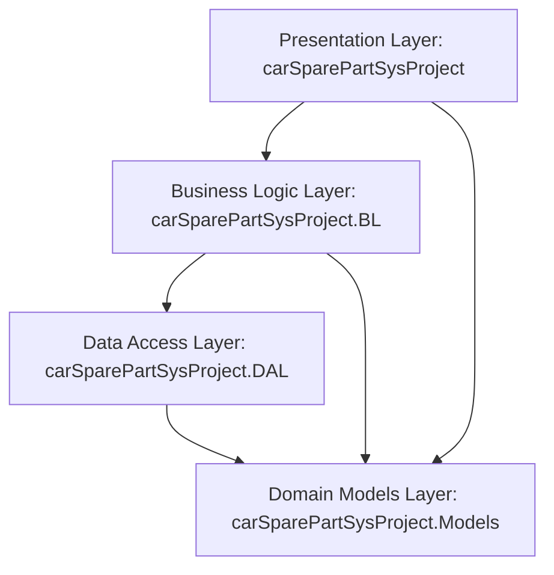
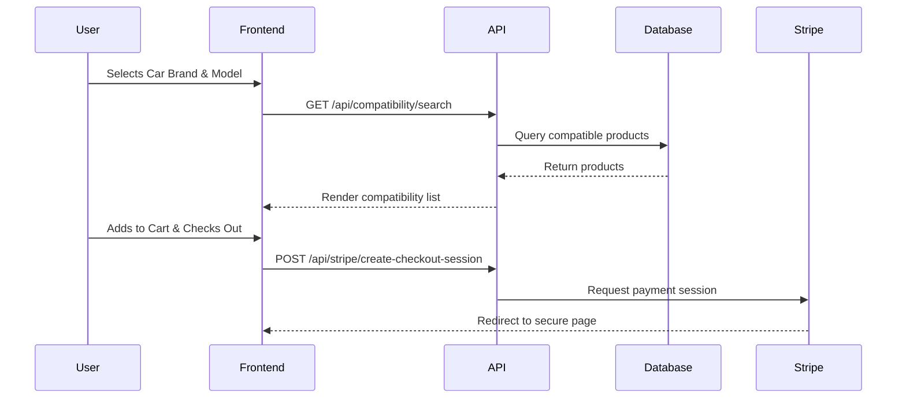

# Car Spare Part e-commerce website

[](https://github.com/nhahub/NHA-4-171/actions)
[](https://opensource.org/licenses/MIT)
[](https://dotnet.microsoft.com/download/dotnet/9.0)
[](https://www.microsoft.com/en-us/sql-server)

An enterprise-grade, Clean Architecture ASP.NET Core e-commerce and inventory platform built specifically for the automotive spare parts industry. 

> [!NOTE]
> ### **CARSPAREPARTSYS CAR SPARE PARTS**


---

## Table of Contents

- [Introduction](#introduction)
- [Why This Project Exists](#why-this-project-exists)
- [Main Features](#main-features)
- [Screenshots](#screenshots)
- [Technology Stack](#technology-stack)
- [Architecture Summary](#architecture-summary)
- [Folder Structure](#folder-structure)
- [Installation & Setup](#installation--setup)
- [Running the Project](#running-the-project)
- [Environment Variables](#environment-variables)
- [Usage](#usage)
- [Project Workflow](#project-workflow)
- [Challenges & Decisions](#challenges--decisions)
- [Future Improvements](#future-improvements)
- [Contributors](#contributors)
- [License](#license)

---

## Introduction

carSparePartSys Car Spare Part System is a production-ready, highly relational e-commerce application designed to handle the unique complexities of automotive parts sales, warehousing, and vehicle compatibility checking. It provides a headless REST API backend built in ASP.NET Core 9.0, paired with an interactive, lightweight frontend using vanilla CSS and JavaScript.

---

## Why This Project Exists

Unlike typical e-commerce solutions that manage uniform catalogs, automotive parts retail is highly complex. A single physical part (e.g., a brake rotor) might only fit specific car brands, models, and manufacturing year ranges. Furthermore, inventory must be tracked across multiple regional warehouses, and orders require robust tracking, returns processing, and secure transaction workflows. carSparePartSys resolves these pain points by offering:
- Strict relational binding between parts, manufacturers, and vehicle model lines.
- Native multi-warehouse stock allocation.
- Direct Stripe checkout integration.

---

## Main Features

- **Vehicle Compatibility Checker**: Filter parts dynamically by selecting Car Brand, Car Model, and manufacturing year range.
- **Cart & Wishlist Systems**: Client-side storage synchronized with database records upon authentication.
- **Order & Returns Pipeline**: Track orders from Pending to Delivered, complete with automated invoice generation and customer return requests.
- **Warehouse & Inventory Tracking**: Support for multiple warehouses, minimum reorder thresholds, and granular stock transaction logs.
- **Stripe Payments**: End-to-end payment processing including Stripe Checkout sessions and secure webhook callbacks.
- **Newsletter Subscription**: Marketing mailing list registration and status management.
- **Role-Based Security**: Access policies dividing workflows into standard Customers, parts Suppliers, and system Administrators.

---

## Screenshots

*Dashboard mockup:* `[ Customer Dashboard & Catalog UI ]`

*Admin console mockup:* `[ Admin Inventory & Orders Console ]`

---

## Technology Stack

### Backend
- **Framework**: .NET 9.0 Web API
- **ORM**: Entity Framework Core 9.0
- **Database Engine**: Microsoft SQL Server
- **Authentication**: JWT Bearer Tokens & ASP.NET Core Identity
- **External APIs**: Stripe (Payments), Cloudinary (Asset management)

### Frontend
- **Structure**: Semantic HTML5
- **Style**: Custom Vanilla CSS3
- **Logic**: Vanilla JavaScript ES6 (built-in API client)

---

## Architecture Summary

carSparePartSys is built using Clean Architecture, separating concerns across distinct layers to maintain high testability and loosely coupled components.



For a comprehensive review, see [system-architecture.md](file:///d:/depi_rahmaANDreem_777/docs/system-architecture.md).

---

## Folder Structure

```text
CarSparePartSys.sln
├── carSparePartSysProject/               # API / Presentation Layer
│   ├── Controllers/            # Thin API Controllers
│   ├── Extensions/             # Dependency Injection composition roots
│   ├── Stripe/                 # Stripe integration config & handlers
│   └── wwwroot/                # Frontend static assets (HTML, CSS, JS)
├── carSparePartSysProject.BL/            # Business Logic Layer
│   └── Service/                # Domain services implementations & interfaces
├── carSparePartSysProject.DAL/           # Data Access Layer
│   ├── Data/                   # DbContext, DB Seed, and database configurations
│   ├── Migrations/             # EF Core database migrations
│   └── Repositories/           # Repository Pattern implementations
├── carSparePartSysProject.Models/        # Domain Models / DTOs
│   ├── Dto/                    # Strongly-typed input and output DTOs
│   └── Model/                  # Database tables/entities mapping
└── CarSparePartSys.Tests/       # xUnit Unit and Mock testing suite
```

Detailed structure details are documented in [folder-structure.md](file:///d:/depi_rahmaANDreem_777/docs/folder-structure.md).

---

## Installation & Setup

1. **Clone the Repository**:
   ```bash
   git clone https://github.com/nhahub/NHA-4-171.git
   cd NHA-4-171
   ```

2. **Configure Configuration Files**:
   Copy the example configuration to development settings:
   ```bash
   cd carSparePartSysProject
   cp appsettings.Development.example.json appsettings.Development.json
   ```

3. **Install Dependencies & Restore Packages**:
   From the root folder:
   ```bash
   dotnet restore
   ```

Refer to the full guide in [installation.md](file:///d:/depi_rahmaANDreem_777/docs/installation.md).

---

## Running the Project

Run the application locally using the .NET CLI:
```bash
cd carSparePartSysProject
dotnet run
```
The application will launch and listen on the configured port (default `8085` or mapped environment variables).
Access the interactive OpenAPI spec at `http://localhost:8085/swagger`.

To run using Docker:
```bash
docker compose up --build -d
```

---

## Environment Variables

| Variable | Description | Default / Example |
| :--- | :--- | :--- |
| `PORT` | Local server port for Kestrel hosting | `8085` |
| `ConnectionStrings__DefaultConnection` | SQL Server DB Connection String | `Server=...;Database=...;` |
| `JWT__Key` | Secret signature key for JWT tokens | `YourSigningKeyOfAtLeast32Bytes...` |
| `Stripe__Secretkey` | Stripe Account Secret Key | `sk_test_...` |
| `CloudinarySettings__CloudName` | Cloudinary storage bucket identifier | `CloudName` |

For detail on variables, see [technology-stack.md](file:///d:/depi_rahmaANDreem_777/docs/technology-stack.md).

---

## Usage

### Customers
1. Register a new account or log in via the Login page.
2. Select vehicle specifications to query compatible parts.
3. Add products to Cart/Wishlist.
4. Proceed to checkout, paying via Stripe card simulation.

### Admins
- Access backend controls at `/admin/dashboard.html`.
- Manage product categories, track stock logs, set product listings, and process orders.

---

## Project Workflow

The customer experience transitions from catalog browsing and vehicle selection to checkout. The diagram below represents the core data flow:



Read more in [project-workflow.md](file:///d:/depi_rahmaANDreem_777/docs/project-workflow.md).

---

## Challenges & Decisions

1. **Circular Referencing**: Direct JSON mapping of highly relational tables can cause infinite serialization loops. We resolved this in `Program.cs` by configuring `JsonSerializerOptions.ReferenceHandler` to `ReferenceHandler.IgnoreCycles`.
2. **Transactional Security**: Payment processing must map reliably to database orders. Stripe webhook events were integrated in `StripeController` to verify transaction events directly before updating order statuses to `Processing`.

---

## Future Improvements

- **Distributed Caching**: Integrating Redis to cache frequently requested catalog queries like car brands and model lists.
- **Full Test Suite**: Increasing xUnit test coverage across all domain services in `carSparePartSysProject.BL`.
- **Search Optimization**: Adding full-text search indexing on product names, SKUs, and descriptions.

Detailed plans are compiled in [future-plan.md](file:///d:/depi_rahmaANDreem_777/docs/future-plan.md).

---

## Contributors

- **carSparePartSys Team** - Core Architecture & Frontend/Backend Development

---

## License

This project is licensed under the MIT License - see the LICENSE file for details.
