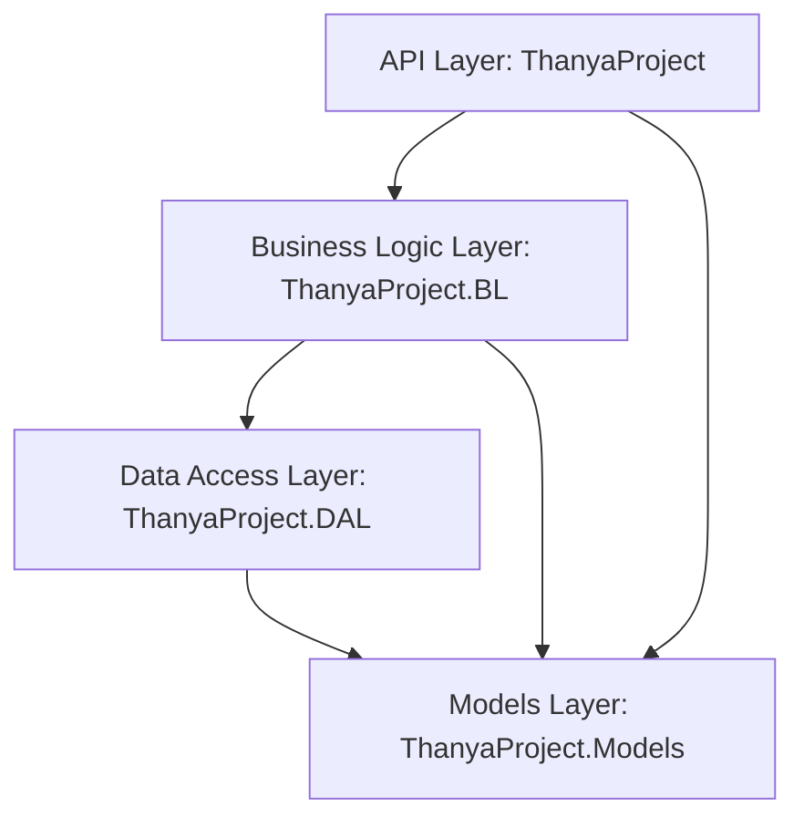

# Thanya Car Spare Part System — API

A Clean Architecture ASP.NET Core Web API for managing car spare parts, orders, payments, and user accounts.

---

## 1. Project Architecture

The solution is designed around Clean Architecture and SOLID principles, ensuring high maintainability and testability:



*   **API Layer (`ThanyaProject`)**: Handles HTTP requests, CORS, Swagger UI, authentication pipelines, and maps endpoints. Controllers speak only to services (never directly to repositories or DbContext).
*   **Business Logic Layer (`ThanyaProject.BL`)**: Contains the core business logic services. Interfaces are defined here and implemented to keep code decoupled.
*   **Data Access Layer (`ThanyaProject.DAL`)**: Integrates EF Core, handles DB seeding, manages SQL repositories, and tracks migration history.
*   **Domain Models Layer (`ThanyaProject.Models`)**: Houses domain models, database entities, and Data Transfer Objects (DTOs).

---

## 2. Folder Structure

```text
CarSparePartSys.sln
├── ThanyaProject/               # API / Presentation Layer
│   ├── Controllers/            # Thin controllers delegating to Service Layer
│   ├── Extensions/             # Startup Extension modules (pure Composition Root)
│   ├── Stripe/                 # Stripe checkout, webhook, and configuration mappings
│   └── Configuration/          # Other configuration files
├── ThanyaProject.BL/            # Business Logic Layer
│   └── Service/                # Logic service implementations and interfaces
├── ThanyaProject.DAL/           # Data Access Layer
│   ├── Data/                   # AppDbContext, database seeding and configuration
│   ├── Migrations/             # EF Core database schema migrations
│   └── Repositories/           # Repository Pattern implementations
├── ThanyaProject.Models/        # Domain Models / DTOs
│   ├── Dto/                    # Strongly-typed input and output DTOs
│   └── Model/                  # Database tables/entities mapping
├── CarSparePartSys.Tests/       # xUnit Unit and Mock testing suite
├── Dockerfile                   # Multistage Docker build config
├── docker-compose.yml           # Multi-container local orchestration (SQL Server + Web API)
└── .github/
    └── workflows/
        └── dotnet.yml           # GitHub Actions CI/CD pipeline
```

---

## 3. Environment Variables & Configuration

Configuration sections mapped from `appsettings.json`, user-secrets, or environment variables:

| Path / Key | Variable Equivalent | Description |
|:---|:---|:---|
| `ConnectionStrings:DefaultConnection` | `ConnectionStrings__DefaultConnection` | SQL Server database connection string |
| `JWT:Key` | `JWT__Key` | HMAC-SHA256 signing key (min. 32 characters) |
| `JWT:Issuer` | `JWT__Issuer` | Token issuer claim (e.g., `ThanyaAPI`) |
| `JWT:Audience` | `JWT__Audience` | Token audience claim (e.g., `ThanyaUser`) |
| `JWT:DurationInMinutes` | `JWT__DurationInMinutes` | Expiry duration for access token in minutes |
| `Stripe:Secretkey` | `Stripe__Secretkey` | Stripe API Secret Key |
| `Stripe:Publishablekey` | `Stripe__Publishablekey` | Stripe API Publishable Key |
| `Stripe:WebhookSecret` | `Stripe__WebhookSecret` | Stripe webhook signature key |
| `CloudinarySettings:CloudName` | `CloudinarySettings__CloudName` | Cloudinary Account Cloud Name |
| `CloudinarySettings:ApiKey` | `CloudinarySettings__ApiKey` | Cloudinary API Key |
| `CloudinarySettings:ApiSecret` | `CloudinarySettings__ApiSecret` | Cloudinary API Secret Key |
| `Admin:Email` | `Admin__Email` | Seeded admin email address |
| `Admin:Password` | `Admin__Password` | Seeded admin account password |

---

## 4. Running Locally

### Prerequisites
*   [.NET 9 SDK](https://dotnet.microsoft.com/download/dotnet/9.0) (or later via roll-forward)
*   SQL Server (Express or LocalDB instance)

### Steps
1.  **Configure local secrets**:
    ```bash
    cd ThanyaProject
    cp appsettings.Development.example.json appsettings.Development.json
    ```
    Open `appsettings.Development.json` and replace standard placeholder credentials with your developer credentials.

2.  **Restore & Build**:
    ```bash
    dotnet restore
    dotnet build
    ```

3.  **Run Migrations**:
    ```bash
    dotnet ef database update --project ../ThanyaProject.DAL --startup-project .
    ```

4.  **Launch application**:
    ```bash
    dotnet run
    ```
    Swagger documentation UI is served by default at: `http://localhost:8080/swagger`

---

## 5. Docker Setup & Running with Docker

Orchestrate the entire stack (ASP.NET API + SQL Server database engine) using one command.

### Running with Docker Compose
From the solution root directory, execute:
```bash
docker compose up --build -d
```
This builds the API image, launches SQL Server 2022, creates the necessary databases, runs EF migrations at startup, and starts the API listening on port `8080`.

---

## 6. Testing

Unit and service mock tests are stored inside `CarSparePartSys.Tests` using **xUnit**, **FluentAssertions**, and **Moq**.

Run the test suite:
```bash
dotnet test
```

---

## 7. GitHub Actions CI/CD

The workflow in `.github/workflows/dotnet.yml` runs on every pull request and push to the `main` branch. It executes:
1.  **Restore** of project dependencies.
2.  **Build** under `Release` configuration.
3.  **Unit Tests** execution. The build fails if any test fails.

---

## 8. Production Deployment Recommendations

1.  **Secrets Management**: Use a secret store provider (AWS Secrets Manager, Azure Key Vault) to inject environment variables securely. Do not store secrets in configuration files.
2.  **HTTPS Enforcement**: Ensure Kestrel is bound to port `443` with a valid TLS certificate, or run the container behind a HTTPS-terminating reverse proxy.
3.  **Security Token Rotation**: Refresh token rotation is fully enabled. Ensure clients handle rotated credentials atomically.
