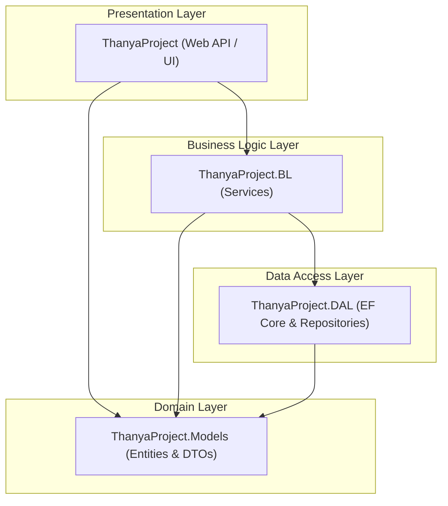
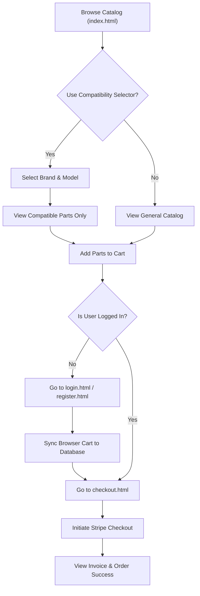
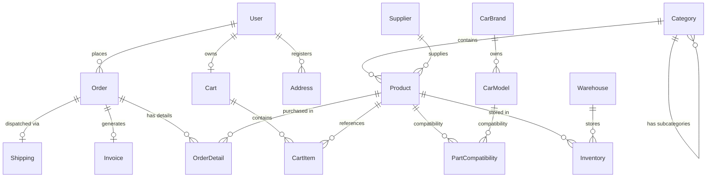
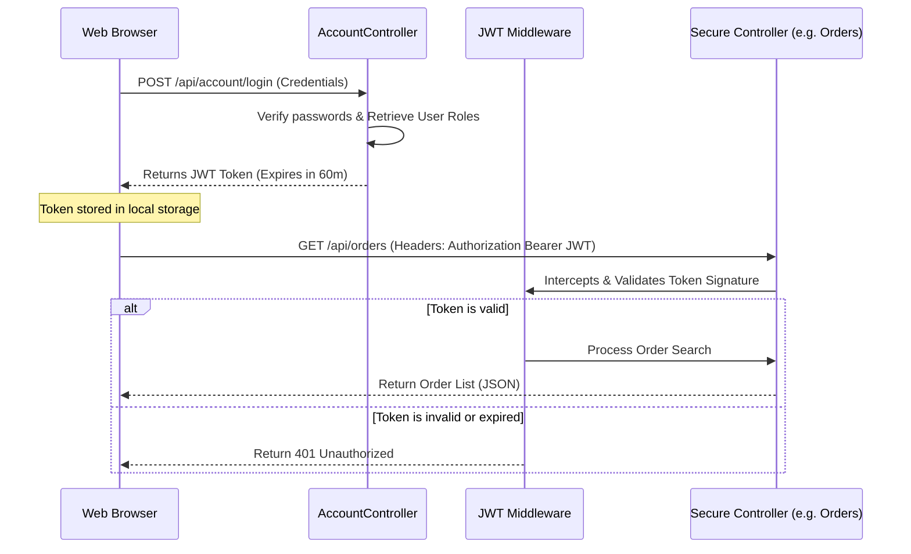
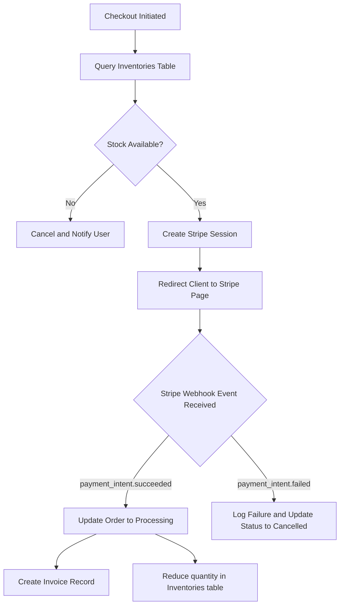
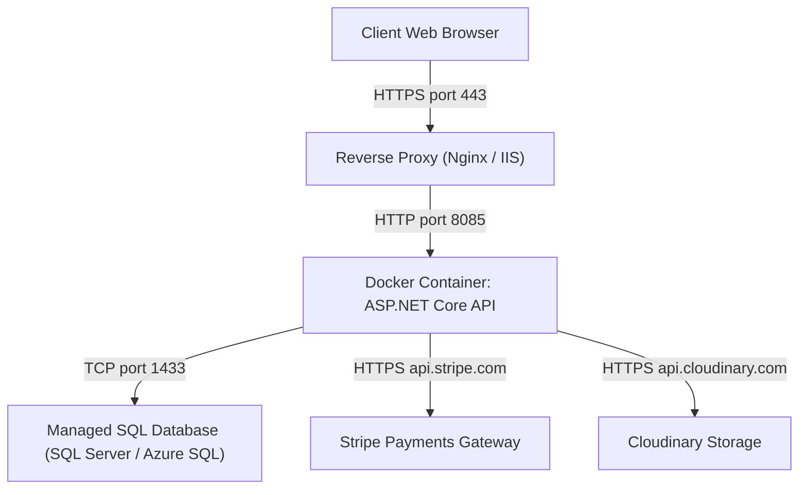

# System Diagrams

This document contains Mermaid diagrams visualizing the architecture, user journeys, relational databases, security pipelines, and deployment layouts for the Thanya Car Spare Part System.

---

## 1. System Architecture

Shows the separation of layers and dependency directions based on Clean Architecture:

---

## 2. User Flow

The process of a customer browsing, filtering, and checking out parts:

---

## 3. Database ER Diagram

A visual representation of the core relationships between entities:

---

## 4. Authentication Flow

How clients obtain and present JWT Bearer tokens to access secure resources:

---

## 5. Application Flow

The flow of database synchronization when checkout occurs:

---

## 6. Deployment Diagram

Physical deployment architecture for production containerization:

